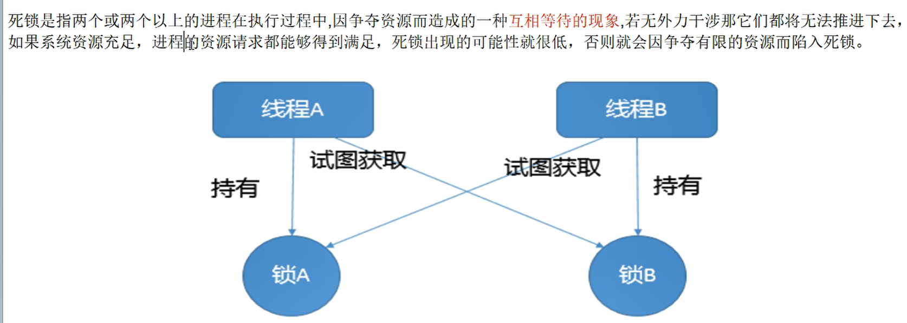

## 10.死锁编码及定位分析

### 10.1 什么是死锁？



#### 10.1.1 写一个死锁吧

```java
/**
 * 演示死锁
 * 死锁就是两个或两个以上的进程在执行过程中，抢夺对方持有，但对方不肯释放的资源，互相等待。
 */
class HoldLockThread implements Runnable{
    
    private String lockA;
    private String lockB;
    
    public HoldLockThread(String lockA, String lockB) {
        this.lockA = lockA;
        this.lockB = lockB;
    }
    @Override
    public void run() {
        synchronized (lockA){
            System.out.println(Thread.currentThread().getName()+"持有"+ lockA + "🔒，然后还想持有"+ lockB +"🔒。");
            try {
                TimeUnit.SECONDS.sleep(2);
            } catch (InterruptedException e) {
                e.printStackTrace();
            }
            synchronized (lockB){
                System.out.println(Thread.currentThread().getName()+"持有"+ lockB + "🔒，然后还想持有"+ lockA +"🔒。");
            }
        }
    }
}
public class DeadLockDemo {
    public static void main(String[] args) {
        String lockA = "lockA";
        String lockB = "lockB";

        new Thread(new HoldLockThread(lockA,lockB),"Thread A ").start();
        new Thread(new HoldLockThread(lockB,lockA),"Thread B ").start();
        
        System.out.println("主线程结束执行。主线程不是守护线程，守护线程是其他非守护线程执行完成之后才结束的。");
    }
}
```

#### 10.1.2 你怎么确定它是死锁呢？有没有可能他只是卡在那里？

> 程序出错不一定就是程序的问题，比如数据库问题，缓存崩了，网络故障，防火墙故障等等

Linux ps -ef | grep xxxxx

windows 下的java也有这个类似ps的查看进程的命令，但是目前我们只用java

​		jps  = java ps       jps -l

**排查Java出错的步骤：用一些Linux底层命令。**

- 日志logs
- 后台控制台错误提示

- jps -l  查看当前运行进程
- jstack  查看栈的情况

```
C:\Users\yangjiewei\IdeaProjects\Base\Interview>jps -l
15504 org.jetbrains.kotlin.daemon.KotlinCompileDaemon
4752 com.all_by_myself.JUC.DeadLockDemo
12264
4680 org.jetbrains.jps.cmdline.Launcher
13100 sun.tools.jps.Jps
```

```
C:\Users\yangjiewei\IdeaProjects\Base\Interview>jstack 4752
2020-12-14 16:40:30
Full thread dump Java HotSpot(TM) 64-Bit Server VM (25.181-b13 mixed mode):

"DestroyJavaVM" #14 prio=5 os_prio=0 tid=0x00000000030b4000 nid=0x3880 waiting on condition [0x0000000000000000]
   java.lang.Thread.State: RUNNABLE

"Thread B " #13 prio=5 os_prio=0 tid=0x000000001a2ab000 nid=0x3958 waiting for monitor entry [0x000000001b00f000]
   java.lang.Thread.State: BLOCKED (on object monitor)
        at com.all_by_myself.JUC.HoldLockThread.run(DeadLockDemo.java:34)
        - waiting to lock <0x00000000d5f9a6d8> (a java.lang.String)
        - locked <0x00000000d5f9a710> (a java.lang.String)
        at java.lang.Thread.run(Thread.java:748)

"Thread A " #12 prio=5 os_prio=0 tid=0x000000001a2aa000 nid=0x3dd8 waiting for monitor entry [0x000000001af0f000]
   java.lang.Thread.State: BLOCKED (on object monitor)
        at com.all_by_myself.JUC.HoldLockThread.run(DeadLockDemo.java:34)
        - waiting to lock <0x00000000d5f9a710> (a java.lang.String)
        - locked <0x00000000d5f9a6d8> (a java.lang.String)
        at java.lang.Thread.run(Thread.java:748)

"Service Thread" #11 daemon prio=9 os_prio=0 tid=0x000000001a1bc800 nid=0x110 runnable [0x0000000000000000]
   java.lang.Thread.State: RUNNABLE

"C1 CompilerThread3" #10 daemon prio=9 os_prio=2 tid=0x000000001a11d000 nid=0x2fe0 waiting on condition [0x0000000000000000]
   java.lang.Thread.State: RUNNABLE

"C2 CompilerThread2" #9 daemon prio=9 os_prio=2 tid=0x000000001a111000 nid=0x3d3c waiting on condition [0x0000000000000000]
   java.lang.Thread.State: RUNNABLE

"C2 CompilerThread1" #8 daemon prio=9 os_prio=2 tid=0x000000001a10c000 nid=0x3cb8 waiting on condition [0x0000000000000000]
   java.lang.Thread.State: RUNNABLE

"C2 CompilerThread0" #7 daemon prio=9 os_prio=2 tid=0x000000001a107000 nid=0x4398 waiting on condition [0x0000000000000000]
   java.lang.Thread.State: RUNNABLE

"Monitor Ctrl-Break" #6 daemon prio=5 os_prio=0 tid=0x000000001a0fc800 nid=0x41a4 runnable [0x000000001a80e000]
   java.lang.Thread.State: RUNNABLE
        at java.net.SocketInputStream.socketRead0(Native Method)
        at java.net.SocketInputStream.socketRead(SocketInputStream.java:116)
        at java.net.SocketInputStream.read(SocketInputStream.java:171)
        at java.net.SocketInputStream.read(SocketInputStream.java:141)
        at sun.nio.cs.StreamDecoder.readBytes(StreamDecoder.java:284)
        at sun.nio.cs.StreamDecoder.implRead(StreamDecoder.java:326)
        at sun.nio.cs.StreamDecoder.read(StreamDecoder.java:178)
        - locked <0x00000000d6033698> (a java.io.InputStreamReader)
        at java.io.InputStreamReader.read(InputStreamReader.java:184)
        at java.io.BufferedReader.fill(BufferedReader.java:161)
        at java.io.BufferedReader.readLine(BufferedReader.java:324)
        - locked <0x00000000d6033698> (a java.io.InputStreamReader)
        at java.io.BufferedReader.readLine(BufferedReader.java:389)
        at com.intellij.rt.execution.application.AppMainV2$1.run(AppMainV2.java:64)

"Attach Listener" #5 daemon prio=5 os_prio=2 tid=0x000000001a054800 nid=0x3d2c waiting on condition [0x0000000000000000]
   java.lang.Thread.State: RUNNABLE

"Signal Dispatcher" #4 daemon prio=9 os_prio=2 tid=0x000000001a053800 nid=0x2d24 runnable [0x0000000000000000]
   java.lang.Thread.State: RUNNABLE

"Finalizer" #3 daemon prio=8 os_prio=1 tid=0x000000001a030800 nid=0x273c in Object.wait() [0x000000001a50e000]
   java.lang.Thread.State: WAITING (on object monitor)
        at java.lang.Object.wait(Native Method)
        - waiting on <0x00000000d5e08ed0> (a java.lang.ref.ReferenceQueue$Lock)
        at java.lang.ref.ReferenceQueue.remove(ReferenceQueue.java:144)
        - locked <0x00000000d5e08ed0> (a java.lang.ref.ReferenceQueue$Lock)
        at java.lang.ref.ReferenceQueue.remove(ReferenceQueue.java:165)
        at java.lang.ref.Finalizer$FinalizerThread.run(Finalizer.java:216)

"Reference Handler" #2 daemon prio=10 os_prio=2 tid=0x000000001813d000 nid=0x156c in Object.wait() [0x000000001a00f000]
   java.lang.Thread.State: WAITING (on object monitor)
        at java.lang.Object.wait(Native Method)
        - waiting on <0x00000000d5e06bf8> (a java.lang.ref.Reference$Lock)
        at java.lang.Object.wait(Object.java:502)
        at java.lang.ref.Reference.tryHandlePending(Reference.java:191)
        - locked <0x00000000d5e06bf8> (a java.lang.ref.Reference$Lock)
        at java.lang.ref.Reference$ReferenceHandler.run(Reference.java:153)

"VM Thread" os_prio=2 tid=0x0000000018139000 nid=0x2a48 runnable

"GC task thread#0 (ParallelGC)" os_prio=0 tid=0x00000000030ca000 nid=0x3154 runnable

"GC task thread#1 (ParallelGC)" os_prio=0 tid=0x00000000030cb800 nid=0x266c runnable

"GC task thread#2 (ParallelGC)" os_prio=0 tid=0x00000000030ce000 nid=0xb7c runnable

"GC task thread#3 (ParallelGC)" os_prio=0 tid=0x00000000030cf800 nid=0x181c runnable

"GC task thread#4 (ParallelGC)" os_prio=0 tid=0x00000000030d2000 nid=0x1b0 runnable

"GC task thread#5 (ParallelGC)" os_prio=0 tid=0x00000000030d3000 nid=0x4204 runnable

"GC task thread#6 (ParallelGC)" os_prio=0 tid=0x00000000030d6000 nid=0x1bd0 runnable

"GC task thread#7 (ParallelGC)" os_prio=0 tid=0x00000000030d7800 nid=0x1b5c runnable

"VM Periodic Task Thread" os_prio=2 tid=0x000000001a1e1800 nid=0x3a88 waiting on condition

JNI global references: 12


Found one Java-level deadlock:
=============================
"Thread B ":
  waiting to lock monitor 0x00000000181434d8 (object 0x00000000d5f9a6d8, a java.lang.String),
  which is held by "Thread A "
"Thread A ":
  waiting to lock monitor 0x0000000018140fb8 (object 0x00000000d5f9a710, a java.lang.String),
  which is held by "Thread B "

Java stack information for the threads listed above:
===================================================
"Thread B ":
        at com.all_by_myself.JUC.HoldLockThread.run(DeadLockDemo.java:34)
        - waiting to lock <0x00000000d5f9a6d8> (a java.lang.String)
        - locked <0x00000000d5f9a710> (a java.lang.String)
        at java.lang.Thread.run(Thread.java:748)
"Thread A ":
        at com.all_by_myself.JUC.HoldLockThread.run(DeadLockDemo.java:34)
        - waiting to lock <0x00000000d5f9a710> (a java.lang.String)
        - locked <0x00000000d5f9a6d8> (a java.lang.String)
        at java.lang.Thread.run(Thread.java:748)

Found 1 deadlock.
```

最后一句简直就是天籁。