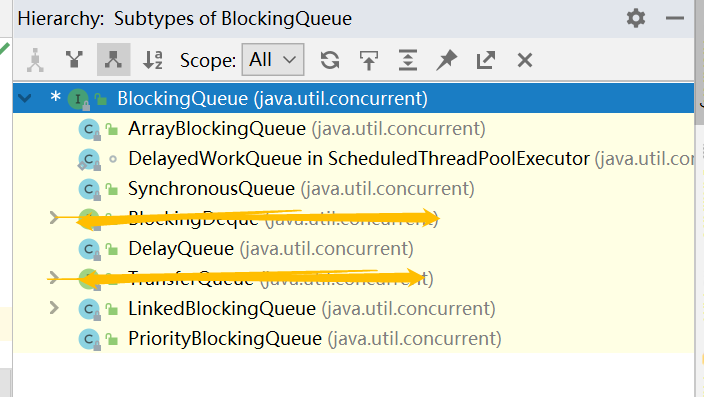

## 7.你对阻塞队列有什么理解吗？聊一下吧

> 阻塞不一定是坏事，让子弹飞一下。

类似于生产者消费者模型：

当阻塞队列是空时，从队列获取元素的操作将会被阻塞；

当阻塞队列是满时，往队列里添加元素的操作就会被阻塞。

#### 7.1 在多线程领域：阻塞就是在某些情况下会挂起线程，也就是阻塞，一旦条件满足后面就会被自动唤醒

##### 为什么需要阻塞队列（blocking queue），有什么好处呢？

因为阻塞队列可以让开发不需要再关注什么时候应该阻塞线程，什么时候应该唤醒线程，JUC包提高了效率并且线程安全。

##### 阻塞对列的核心方法有哪些？

**这里有个要记的地方就是：阻塞队列（blocking queue）他也集合类下的一个子类，**

**collection--queue--blockingqueue，**

