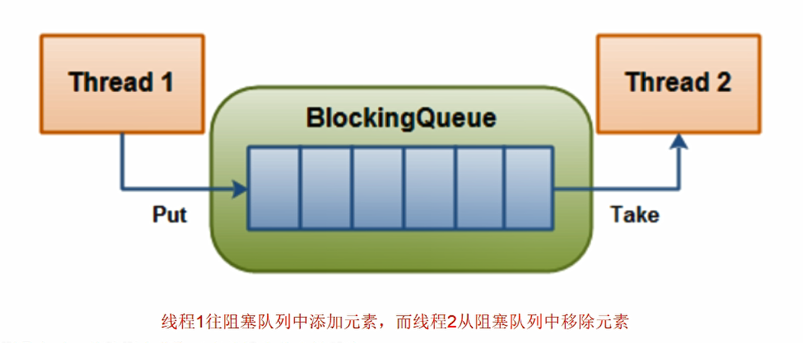
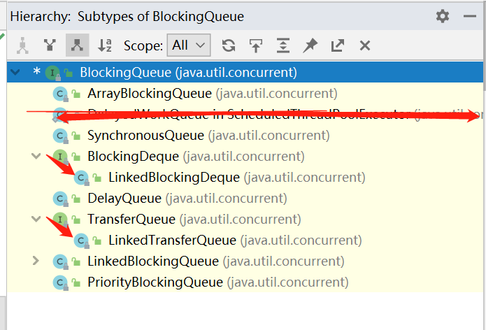

## 7.你对阻塞队列有什么理解吗？聊一下吧

> 阻塞不一定是坏事，让子弹飞一下。

类似于生产者消费者模型：

当阻塞队列是空时，从队列获取元素的操作将会被阻塞；

当阻塞队列是满时，往队列里添加元素的操作就会被阻塞。

#### 7.1 在多线程领域：阻塞就是在某些情况下会挂起线程，也就是阻塞，一旦条件满足后面就会被自动唤醒

##### 为什么需要阻塞队列（blocking queue），有什么好处呢？

因为阻塞队列可以让开发不需要再关注什么时候应该阻塞线程，什么时候应该唤醒线程，JUC包提高了效率并且线程安全。

##### 阻塞对列的核心方法有哪些？add/remove/offer/poll/put/take

**这里有个要记的地方就是：阻塞队列（blocking queue）他也集合类下的一个子类，**

**collection--queue--blockingqueue，**

**blockingqueue和list平级，下面这三个是重点**

ArrayBlockingQueue:由数组组成的有界阻塞队列

LinkedBlockingQueue:由链表结构组成的有界阻塞队列，有bug，他的有界最大值可以达到Integer.MAX_VALUE.

SynchronousQueue: 不存储元素的阻塞队列，也就是只有单个元素阻塞队列，有一个就消费一个，类似于定制化

BlockingQueue核心方法：

add() 队列满的时候会直接抛出异常

remove() 队列为空时直接抛出异常

上面太火了点，我喜欢温柔的。

offer() 也是插入队列，即使插入失败也不会抛出异常，只会返回false。另外还有带阻塞时间

poll() 移除失败就会返回null，成功就返回元素

那我要是想要没有返回值的呢？

put()  插入元素没有返回值，成功与否不知道，满了就阻塞等着或者中断退出

take() 取出元素，即使空对列也会一直等待下去，直到消费完成。

##### 阻塞队列可以用在哪里？

- 生产者消费者模式 
- 线程池
- 消息中间件