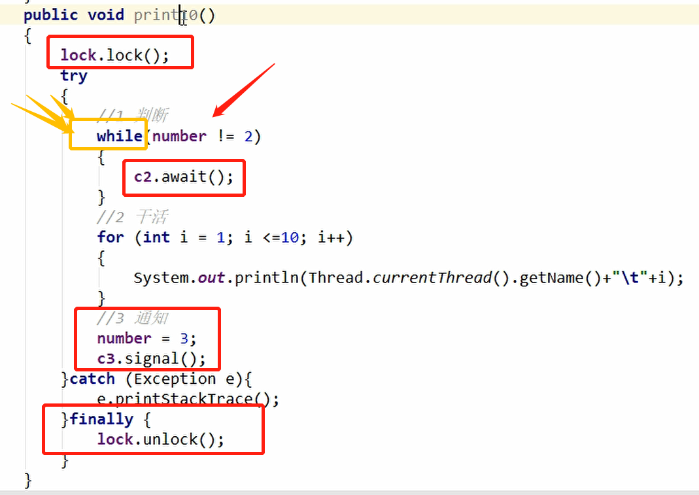

## 8. 那synchronized和lock有什么区别吗？

### 8.1 原始构成

#### synchronized是关键字，属于JVM层面的。

- monitorenter 底层是通过monitor对象来完成，其实wait/notify等方法也依赖于monitor对象，只有在同步块或方法中才能调用wait/notify等方法
- monitorexit * 2 异常退出和正常退出

#### lock是具体类（java.util.concurrent.locks.Lock）是api层面的锁🔒。

### 8.2 使用方法

#### synchronized 不需要用户去手动释放锁，代码执行完就能自动释放锁。

#### ReentrantLock 则需要用户去手动释放锁，如果没有手动释放可能会出现死锁。

### 8.3 等待是否可中断

#### synchronized不可中断，除非你抛出异常或者正常运行完成。

#### ReentrantLock 可以中断，1.设置超时方法，trylock(long ....)

#### 				 2.lockInterruptibly()放代码块中，调用interrupt()方法中断

### 8.4 加锁是否公平

#### synchronized是非公平锁。

#### ReentrantLock 默认是非公平锁，可以通过构造函数修改。

### 8.5 锁绑定多个条件condition

#### synchronized没有这个东东。

#### ReentrantLock 用来实现分组唤醒需要唤醒的线程们，可以精确唤醒，很灵活，而不像synchronized唤醒，要么一个要么全部线程。

> 使用方式：Condition c1 = lock.newCondition() 
>
> ​					Condition c2 = lock.newCondition() 
>
> ​					Condition c3 = lock.newCondition() 
>
> ​					c1.await() ---> c2.signal()  
>
> ​		就可以让c1进行阻塞，执行完业务之后对c2进行唤醒。指定唤醒，就是相当于我现在把执行的这个权利交给你。接收到signal的条件就会在await处跳出循环。这个过程需要通过标志位来改变。

