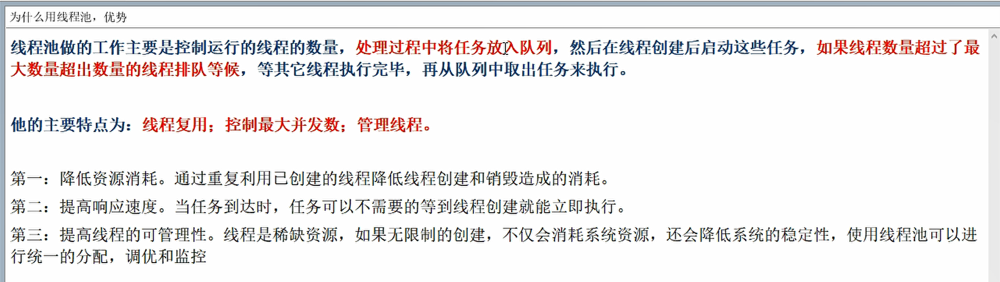
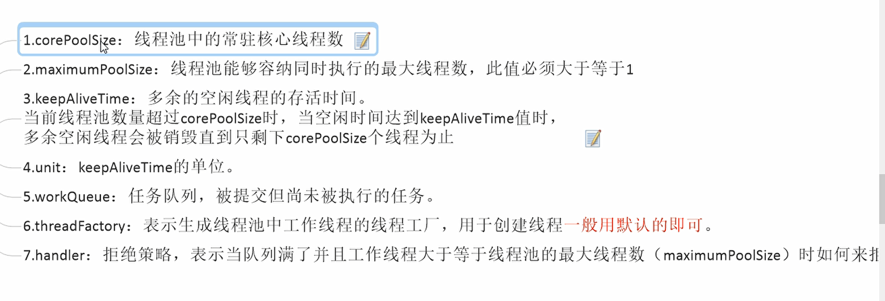
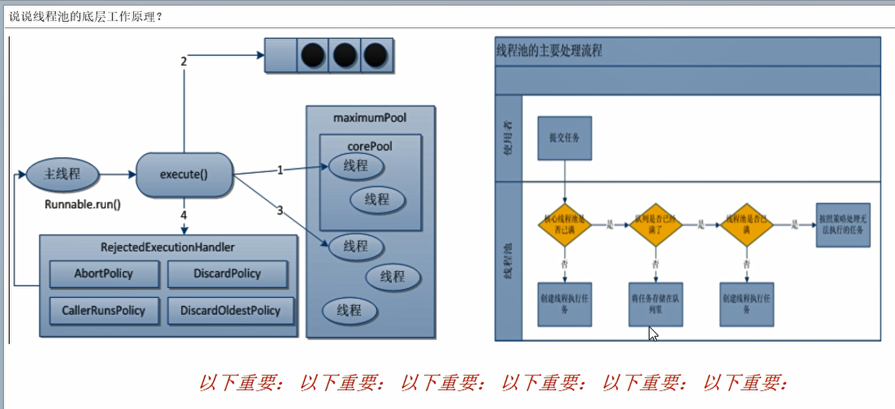
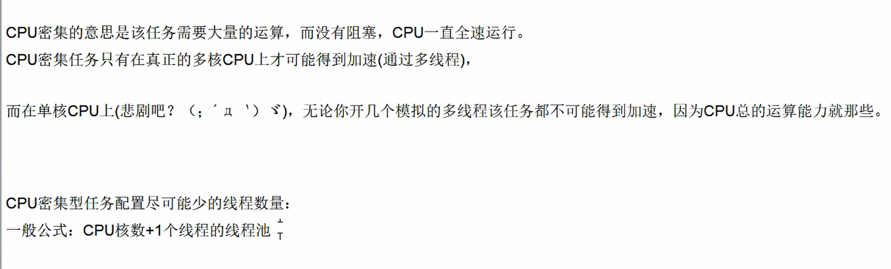
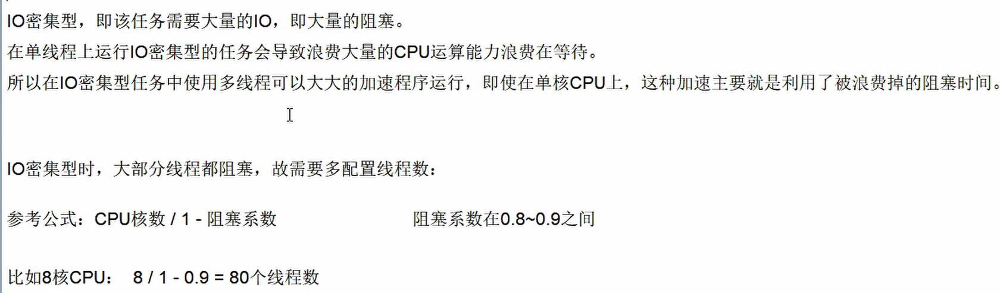

## 9.线程池用过吗？说说你对ThreadPoolExecutor的理解？

```java
/**
 * 多线程中三种常用的获得多线程的方法
 *  1.继承thread类
 *  2.实现runnable接口
 *  3.实现callable接口
 * callable是会带返回值的线程接口，还会抛出异常，实现方法为call
 */
class MyThread implements Callable<Integer>{
    @Override
    public Integer call() throws Exception {
        System.out.println(Thread.currentThread().getName()+"========");
        return 1024;
    }
}
public class CallableDemo {
    public static void main(String[] args) throws ExecutionException, InterruptedException {
        // 这里很有意思的点就是：thread类构造方法没有直接传callable的
        // 他用了适配器模式，用runnable的子接口RunnableFuture<V>的一个实现类FutureTask。
        // 实现适配
        // FutureTask(Callable<V> callable)
        // 使用场景：多线程后台计算啊
        // futureTask.get()会要求一定要获得执行结果，如果计算不完成会导致堵塞。直到你拿到结果。主要保证主线程也无法退出。
        // 一般最后才执行这个操作
        FutureTask<Integer> futureTask = new FutureTask<>(new MyThread());
        FutureTask<Integer> futureTask1 = new FutureTask<>(new MyThread());

        Thread thread = new Thread(futureTask, "AA");
        new Thread(futureTask, "BB").start(); // 同一个futuretask只会执行一次，一个任务为什么要做两次呢？java会复用
       // new Thread(futureTask1,"BB").start(); // 这个就是两个任务两个线程必定跑两次
        thread.start();
        System.out.println(Thread.currentThread().getName());
//        while (!futureTask.isDone()){
//            System.out.println(Thread.currentThread().getName() + "这里就有点像自旋锁，一直让主线程等在这");
//        }
        Integer integer = futureTask.get(); // get方法获取返回值。
        System.out.println("我的返回值是：" + integer);
    }
}
```

### 9.1 为什么用线程池呢？有什么优势

>  减少上下文切换，降低性能开销。



ThreadPoolExecutor类是线程池的底层实现类。7个参数分别是什么？

```java
    /**
     * Creates a new {@code ThreadPoolExecutor} with the given initial
     * parameters.
     *
     * @param corePoolSize the number of threads to keep in the pool, even
     *        if they are idle, unless {@code allowCoreThreadTimeOut} is set
     * @param maximumPoolSize the maximum number of threads to allow in the
     *        pool
     * @param keepAliveTime when the number of threads is greater than
     *        the core, this is the maximum time that excess idle threads
     *        will wait for new tasks before terminating.
     * @param unit the time unit for the {@code keepAliveTime} argument
     * @param workQueue the queue to use for holding tasks before they are
     *        executed.  This queue will hold only the {@code Runnable}
     *        tasks submitted by the {@code execute} method.
     * @param threadFactory the factory to use when the executor
     *        creates a new thread
     * @param handler the handler to use when execution is blocked
     *        because the thread bounds and queue capacities are reached
     * @throws IllegalArgumentException if one of the following holds:<br>
     *         {@code corePoolSize < 0}<br>
     *         {@code keepAliveTime < 0}<br>
     *         {@code maximumPoolSize <= 0}<br>
     *         {@code maximumPoolSize < corePoolSize}
     * @throws NullPointerException if {@code workQueue}
     *         or {@code threadFactory} or {@code handler} is null
     */
    public ThreadPoolExecutor(int corePoolSize,
                              int maximumPoolSize,
                              long keepAliveTime,
                              TimeUnit unit,
                              BlockingQueue<Runnable> workQueue,
                              ThreadFactory threadFactory,
                              RejectedExecutionHandler handler) {
        if (corePoolSize < 0 ||
            maximumPoolSize <= 0 ||
            maximumPoolSize < corePoolSize ||
            keepAliveTime < 0)
            throw new IllegalArgumentException();
        if (workQueue == null || threadFactory == null || handler == null)
            throw new NullPointerException();
        this.acc = System.getSecurityManager() == null ?
                null :
                AccessController.getContext();
        this.corePoolSize = corePoolSize;
        this.maximumPoolSize = maximumPoolSize;
        this.workQueue = workQueue;
        this.keepAliveTime = unit.toNanos(keepAliveTime);
        this.threadFactory = threadFactory;
        this.handler = handler;
    }
```



### 9.2 说说线程池的底层工作原理。



核心线程数被占用之后，就到阻塞队列，阻塞队列满了就加大线程数来处理，最大是max，再继续来的话就使用拒绝策略，后面如果加班窗口到时间就被清除，就还是只有核心线程。

### 9.3 生产上你如何设置合理的参数？

#### 9.3.1 什么是拒绝策略？

拒绝策略是当等待队列已经排满，放不下新任务时，同时线程池中的max线程也达到了最大，无法为新服务服务，这时候我们就需要拒绝策略机制来配合处理问题。

- AbortPolicy：直接抛出RejectedExecutionException异常阻止系统运行
- CallerRunsPolicy：调用者运行 调节机制，该策略不抛弃也不会异常，而是将任务回退给调用者
- DiscardOldestPolicy：抛弃等待最久的任务，然后把当前任务加入队列中尝试提交当前任务
- DiscardPolicy：直接丢弃任务，不处理也不出异常

以上内置拒绝策略均实现了RejectedExecutionHandler接口

#### 9.3.2 你在工作中单一的、带缓存的、固定线程数的三种线程池方法，niyogn那个最多，超级坑？一个都不用！！

我们一个都不用，我们生产中只用自定义的，Executors中JDK已经给你提供了，为什么不用？阿里实践出来的结论啊，我们得用ThreadPoolExecutor的方式来创建。

#### 9.3.3 你在工作中如何使用线程池的，是否自定义过线程池使用。

```java
/**
 * 自己写一个线程池
 *      拒绝策略：
 *          new ThreadPoolExecutor.AbortPolicy() 在有9个人的时候直接拒绝抛出异常
 *          new ThreadPoolExecutor.CallerRunsPolicy() 调用者运行机制，不放弃任务也不抛出异常，谁调用谁来执行任务。
 *          new ThreadPoolExecutor.DiscardOldestPolicy() 直接把等的最久的给送回家
 *          new ThreadPoolExecutor.DiscardPolicy()直接丢弃任务
 */
public class MyThreadPoolDemo {
    public static void main(String[] args) {
        // System.out.println(Runtime.getRuntime().availableProcessors()); // 看看能用多少处理器
        ExecutorService threadpool = new ThreadPoolExecutor(
                2,
                5,
                1L,
                TimeUnit.SECONDS,
                new LinkedBlockingQueue<Runnable>(3),
                Executors.defaultThreadFactory(),
                new ThreadPoolExecutor.DiscardPolicy());
        try{
            // 模拟10个人过来处理，9个人过来的时候就爆了，最多只能8个人。
            for (int i = 0; i < 15; i++) {
                threadpool.execute(()->{
                    System.out.println(Thread.currentThread().getName()+ "办理业务！");
                });
            }
        }catch (Exception e){
            e.printStackTrace();
        }finally {
            threadpool.shutdown();
        }
    }
}
```

#### 9.3.4 最大线程数你设置多少？合理配置线程池你是怎么考虑的？

##### CPU密集型：CPU核数+1个线程的线程池



##### IO密集型

- 1.由于IO密集型任务线程并不是一直在执行任务，则应该配置尽可能多的线程，如CPU核数*2

- 2.如下

  

