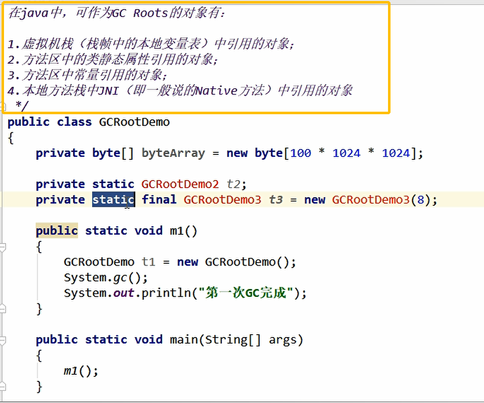

## 1.JVM垃圾回收的时候如何确定垃圾？是否知道什么是GC Roots？

### 1.1什么是垃圾？

> 简单的说就是内存中不再使用的空间就是垃圾。

### 1.2要进行垃圾回收，如何判断一个对象是否可以被回收？

#### 1.2.1引用计数法（Java不用是因为不能解决循环引用）

#### 1.2.2枚举根节点做可达性分析（根搜索路径）

> 基本思想就是通过一系列名为“GC ROOTS”的对象作为起始点，从这个被称为GC roots的对象开始搜索，如果一个对象到GC ROOTS没有任何引用链相连时，则说明对象不可用。
>
> 也即给定**一个集合的引用作为根出发，通过引用关系遍历对象图**，能被可到达，对象就被判定为存活，没有遍历到的就是死亡对象，也就是垃圾。

**我一般只会说：非堆中引用对象**

