## 2.你说你做过JVM调优和参数设置，请问如何盘点查看JVM系统默认值呢？

### 2.1JVM的参数类型有哪些？

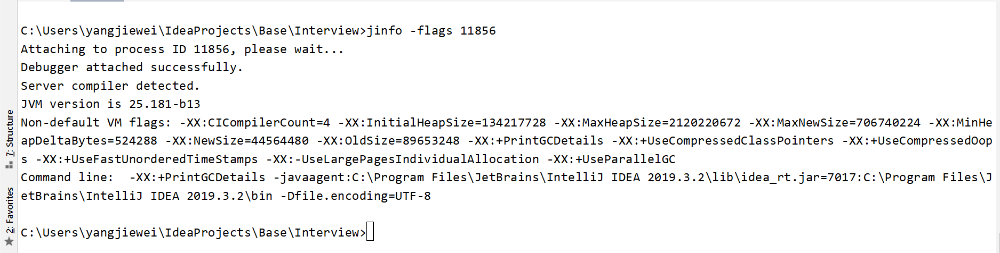

#### 2.1.1 标配参数

- java -version
- java -help
- java -showversion

#### 2.1.2 X参数

- -Xint   解释执行
- -Xcomp  第一次使用就编译成本地代码
- -Xmixed  混合模式

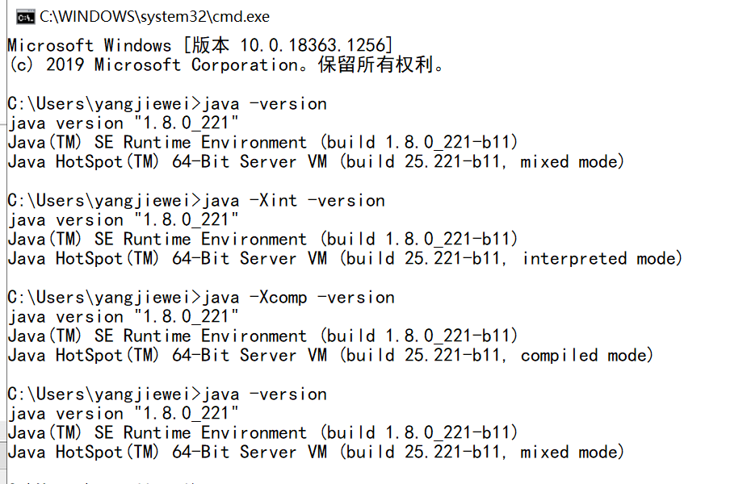

#### 2.1.3 XX参数（重点）

- **Boolean类型**

  - -XX:+ 或者- 某个属性值  （+开启   -关闭）

  - case：是否打印GC细节（-XX:+PrintGCDetails）是否使用串行回收垃圾器

    ```java
    C:\Users\yangjiewei\IdeaProjects\Base\Interview>jps -l  // 查看当前运行线程
    8096 com.yjiewei.test.test1
    17620 org.jetbrains.jps.cmdline.Launcher
    12264
    23288 org.jetbrains.kotlin.daemon.KotlinCompileDaemon
    4012 sun.tools.jps.Jps
    
    C:\Users\yangjiewei\IdeaProjects\Base\Interview>jinfo -flag PrintGCDetails 8096
    -XX:-PrintGCDetails   // 默认不开启
        
    C:\Users\yangjiewei\IdeaProjects\Base\Interview>jinfo -flag UseSerialGC 11856
    -XX:-UseSerialGC
    ```

- **KV设值类型**

  - -XX:属性key=属性值value

  - case：-XX:MetaspaceSize=128m    -XX:MaxTenuringThreshold=15

    ```
    C:\Users\yangjiewei\IdeaProjects\Base\Interview>jinfo -flag MetaspaceSize 11856
    -XX:MetaspaceSize=21807104  // 21M
    
    C:\Users\yangjiewei\IdeaProjects\Base\Interview>jinfo -flag MaxTenuringThreshold 11856
    -XX:MaxTenuringThreshold=15  // 15岁
    ```

- **坑爹的地方**

  - -Xms  堆的初始值   -XX:InitialHeapSize=1024M   等于  -Xms1024M
  - -Xmx  堆的最大值  -XX:MaxHeapSize
  - -Xss  每个线程栈的初始值

### 2.2盘点查看JVM默认值

最后一个是常用的命令显示。

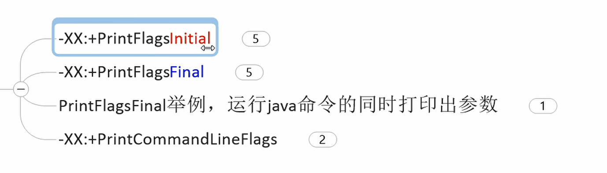

下面的参数有一些会出现等号= ，有一些会出现 := 区别是前者是初始值，后者是加载过程被修改过的值。

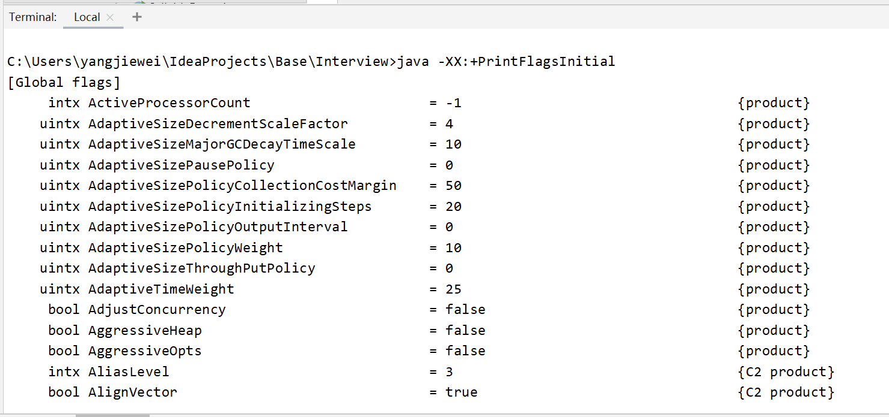

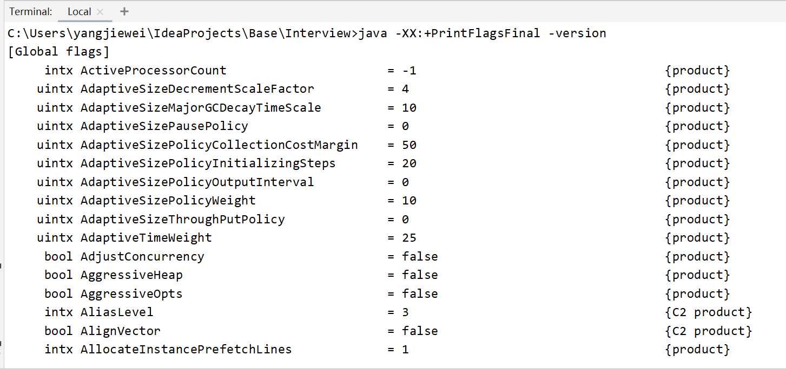

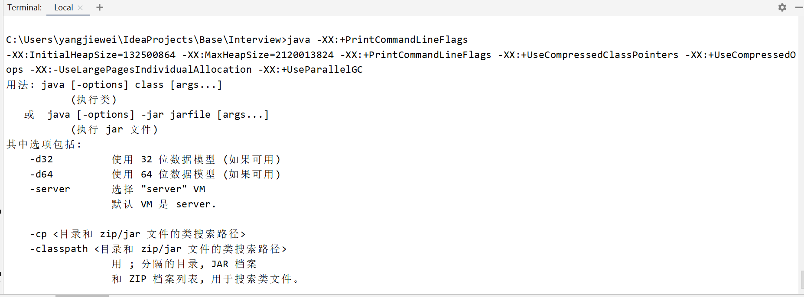

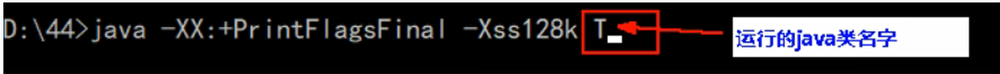

### 2.3下面这些参数要背

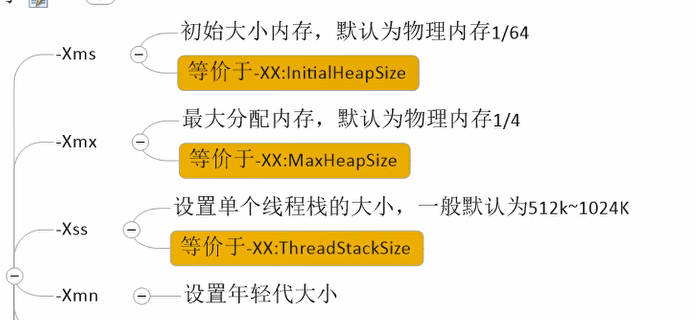

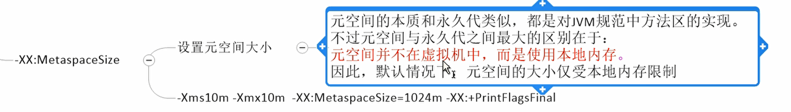

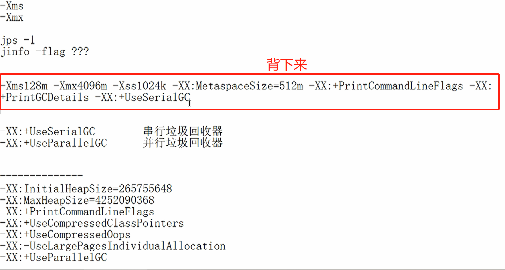


- -XX:+PrintGCDetails  打印详细GC信息，一般输出为 名称：GC前内存->GC后内存（该区总内存）
- -XX: SurvivorRatio     eden : from: to

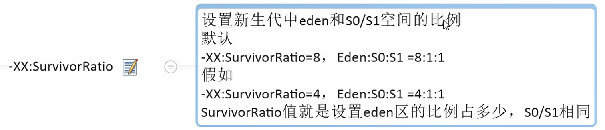

- -XX:NewRatio  young : old

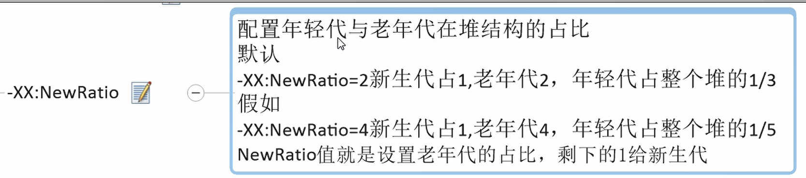

- -XX:MaxTenuringThreshold=15   默认进入老年代的年龄是15岁。