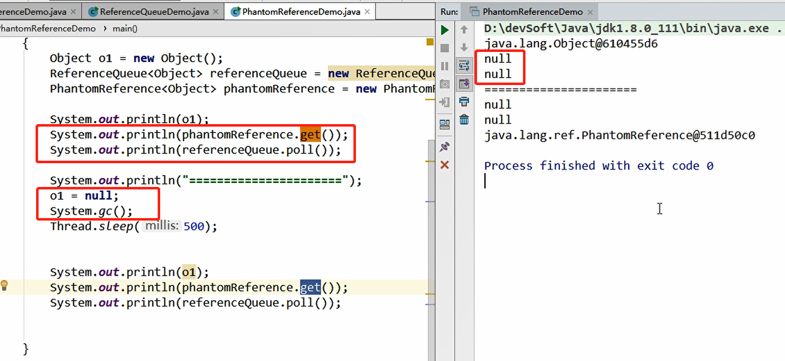

## 3.强引用、软引用、弱引用、虚引用分别是什么？

### 3.1强引用

当内存不足，JVM开始垃圾回收，对于强引用对象，就算是出现了OOM也不会对改对象进行垃圾回收。

强引用就是我们最常见的普通对象引用，是Java内存泄漏的主要原因之一。

除非你把引用置为null。

### 3.2软引用

比强引用低一级，当内存充足时，他不会被回收，当内存不足时就会被回收。

通常在高速缓存的地方会用到。

### 3.3弱引用

比软引用还要弱一级，只要垃圾回收一启动，不管空间是否足够，都会回收改对象占用的内存。

### 3.4什么样的场景使用软引用/弱引用？

### 3.5知道的挺多啊，那你知道WeakHashMap吗？

就是弱引用版的hashmap啊，垃圾回收的时候会被回收，不是强引用。

### 3.6虚引用

> 幽灵👻引用

顾名思义就是形同虚设，与其他几个引用都不同，虚引用不会决定对象的生命周期，如果对象仅持有虚引用，那么它和没有任何引用是一样的，在任何时候都可能被垃圾回收器回收，也不能单独通过他来访问对象，虚引用必须和引用队列(Reference Queue)共同使用。

**主要作用是跟踪对象被垃圾回收的状态，用来后续对象被回收之后的一个处理。**

**！！被回收之前需要被引用队列保存一下。**

引用队列简单了解，作为后置通知。

### 3.7GCRoots和四大引用小总结

GCRoots 非堆中引用的对象。