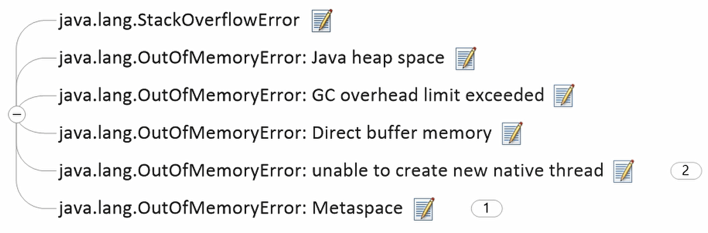
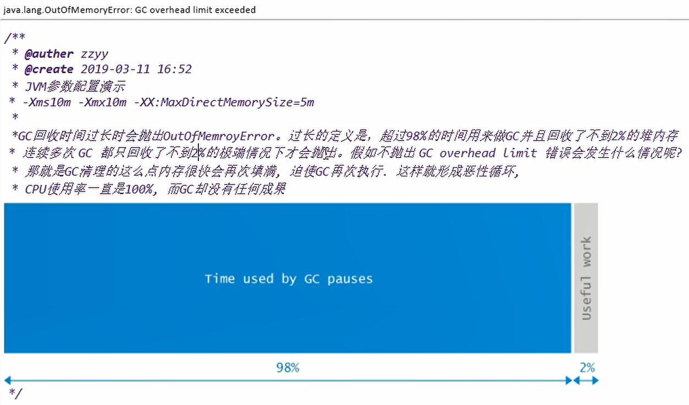
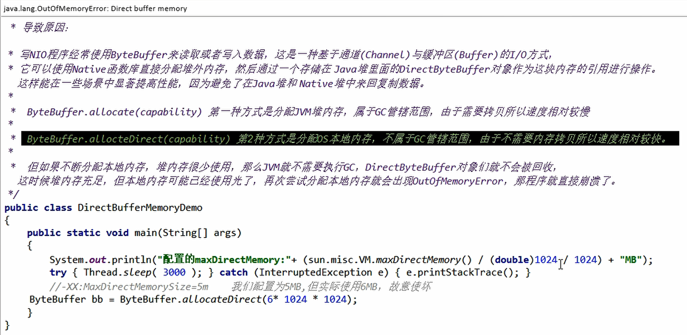
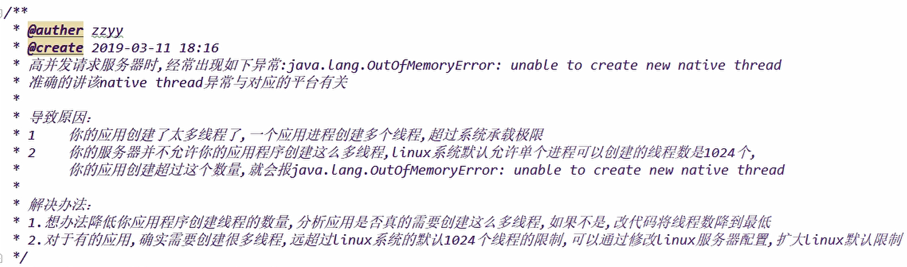
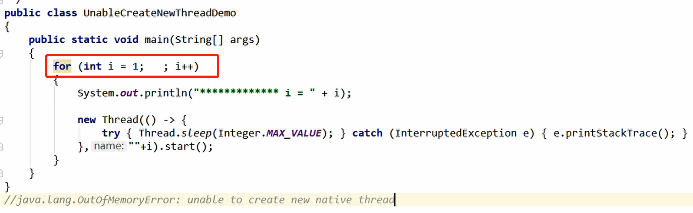
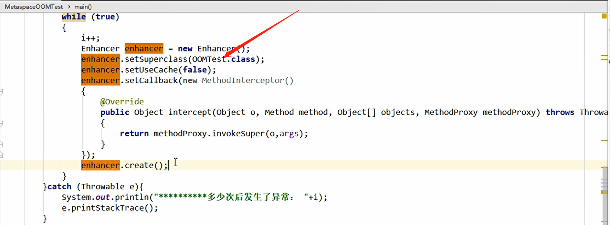

## 4.谈谈你对OOM的理解？



### 4.1 StackOverFlowError

```
java.lang.Object 
	java.lang.Throwable 
		java.lang.Error 
			java.lang.VirtualMachineError 
				java.lang.StackOverflowError 
    
public class StackOverflowError
		extends VirtualMachineError
当堆栈溢出的发生是因为一个应用递归太深。 
```

- 递归，超出栈内存


### 4.2 OutOfMemoryError:Java heap space

- 程序中连续分配大对象就会出现这样的情况。


### 4.3 OutOfMemoryError:GC overhead limit exceeded

- GC回收时间过长，内存一直在分配，而且一直在回收，但是对象都不是垃圾




### 4.4 OutOfMemoryError:Direct buffer memory

- 元空间只会受限于本地内存
- native 方法 ，NIO引起的



```java
public class DirectBufferMemoryDemo {
    public static void main(String[] args) {
        // 我的内存是8G，这里大概1/4  配置的最大直接内存：1797MB
        System.out.println("配置的最大直接内存：" + (sun.misc.VM.maxDirectMemory()/ 1024 / 1024 ) + "MB");

        // 使诈  -Xms10m -Xmx10m -XX:PrintGCDetails -XX:MaxDirectMemorySize=5m
        ByteBuffer bb = ByteBuffer.allocateDirect(6*1024*1024);
    }
}
```

```
配置的最大直接内存：5MB
[GC (System.gc()) [PSYoungGen: 1920K->488K(2560K)] 1920K->752K(9728K), 0.0049124 secs] [Times: user=0.00 sys=0.00, real=0.01 secs] 
[Full GC (System.gc()) [PSYoungGen: 488K->0K(2560K)] [ParOldGen: 264K->662K(7168K)] 752K->662K(9728K), [Metaspace: 3358K->3358K(1056768K)], 0.0065179 secs] [Times: user=0.00 sys=0.00, real=0.01 secs] 
Exception in thread "main" java.lang.OutOfMemoryError: Direct buffer memory
	at java.nio.Bits.reserveMemory(Bits.java:694)
	at java.nio.DirectByteBuffer.<init>(DirectByteBuffer.java:123)
	at java.nio.ByteBuffer.allocateDirect(ByteBuffer.java:311)
	at com.all_by_myself.JVM.DirectBufferMemoryDemo.main(DirectBufferMemoryDemo.java:15)
Heap
 PSYoungGen      total 2560K, used 164K [0x00000000ffd00000, 0x0000000100000000, 0x0000000100000000)
  eden space 2048K, 8% used [0x00000000ffd00000,0x00000000ffd293f8,0x00000000fff00000)
  from space 512K, 0% used [0x00000000fff00000,0x00000000fff00000,0x00000000fff80000)
  to   space 512K, 0% used [0x00000000fff80000,0x00000000fff80000,0x0000000100000000)
 ParOldGen       total 7168K, used 662K [0x00000000ff600000, 0x00000000ffd00000, 0x00000000ffd00000)
  object space 7168K, 9% used [0x00000000ff600000,0x00000000ff6a5a58,0x00000000ffd00000)
 Metaspace       used 3475K, capacity 4496K, committed 4864K, reserved 1056768K
  class space    used 379K, capacity 388K, committed 512K, reserved 1048576K

Process finished with exit code 1
```

```
Exception in thread "main" java.lang.OutOfMemoryError: Direct buffer memory
```


### 4.5 OutOfMemoryError:Unable to create new native thread

> 大厂面试高并发场景，微服务线程数能有多少？






### 4.6 OutOfMemoryError:Metaspace

元空间：存放虚拟机加载的类信息，常量池，静态变量，即时编译后的代码

-XX:MetaspaceSize=8m  -XX:MaxMetaspaceSize=8m

