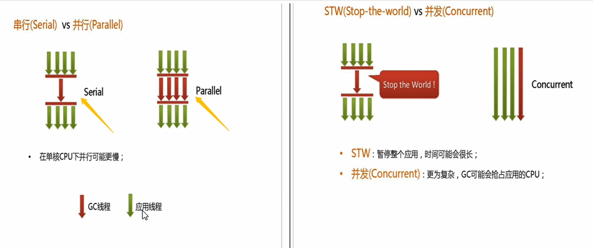
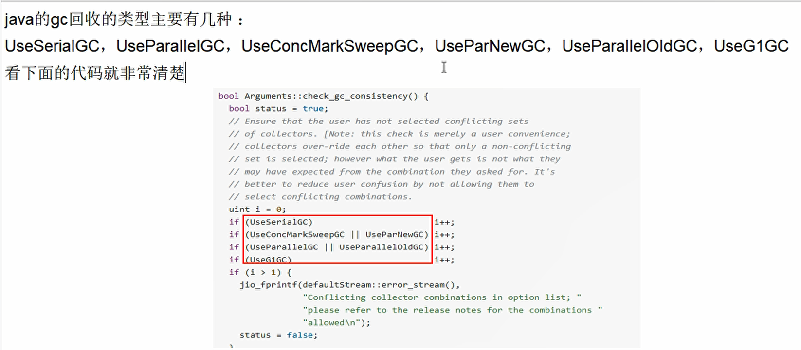
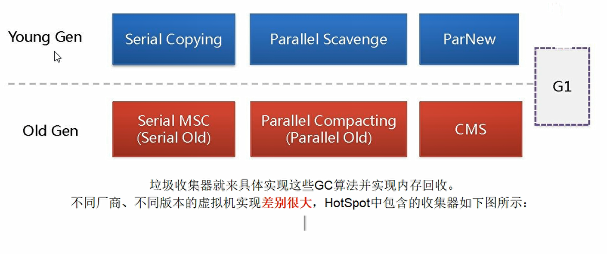
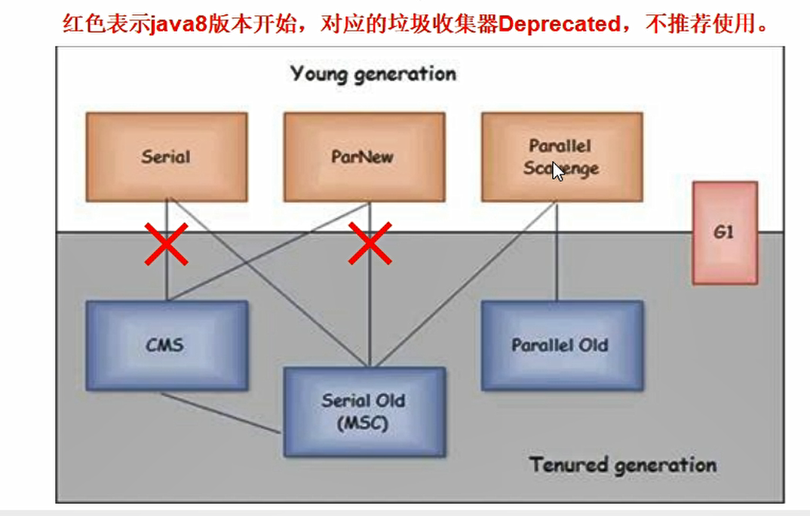
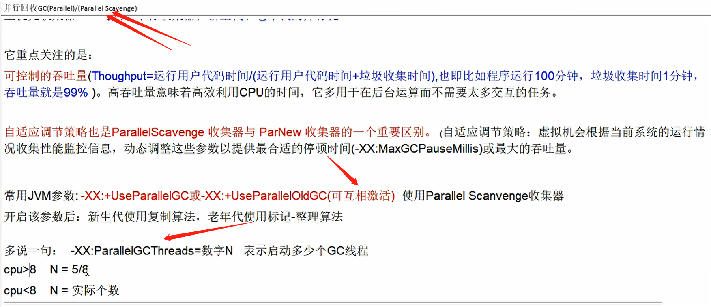
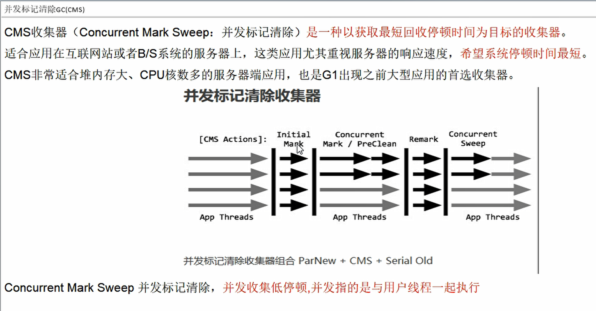
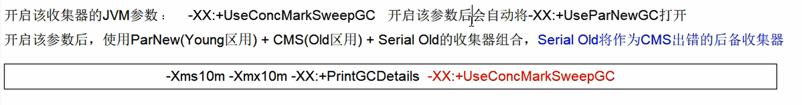
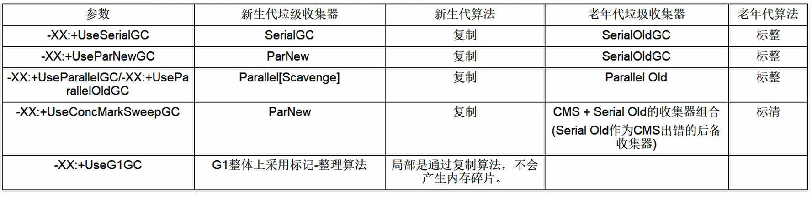

## 5.GC垃圾回收算法和垃圾收集器的关系？你说说看

### 5.1 垃圾回收算法

- 引用计数算法（现在只用可达性分析）
- 复制算法
- 标记清除算法
- 标记整理算法

### 5.2 垃圾回收器

> 只有最合适，没有最完美。

- serial : 串行
- parallel ：并行
- CMS ：concurrent mark sweep  并发
- G1垃圾回收器

1. 串行垃圾回收器serial

stop the world，非垃圾回收线程停止，只允许单线程垃圾回收。（只能一个人扫地）

2. 并行垃圾回收器parallel

多个垃圾收集线程并行工作，此时用户线程是暂停的，适合与前台交互弱的场景，相当于多线程serial。（一个或多个人扫地）

3. CMS并发收集器

用户线程和垃圾收集线程同时执行，可能是并行，可能交替执行，不需要stw，互联网用得最多，适合对响应时间有要求的场景。（一个人、多个人，扫地或者吃饭都可以）

4. G1  garbage first

它是将堆内存分割成不同的区域然后并发的对其进行垃圾回收。分块

### 5.3 怎么查看服务器默认的垃圾回收器是哪个呢？生产上如何配置垃圾回收器？谈谈你对垃圾回收器的理解。

- 怎么查看你用的是什么？**java  -XX:+PrintCommandLineFlags -version**

  java 8 使用的是并行垃圾回收器

  jps -l

  jinfo -flags UseParrallelGC pid

- 默认的垃圾回收器有

- **重点：垃圾回收器**

### 5.3 如何选择垃圾收集器？

- **单CPU，小内存 （-XX:+UseSerialGC）**
- **多CPU，需要最大吞吐量，如后台计算型运用 （-XX:+UseParallelGC  or -XX:+UseParallelOldGC）**
- **多CPU，追求低停顿时间，需要快速响应的互联网应用（CMS  -XX:+UseConcMarkSweepGC                              -XX:+ParNewGC）**

