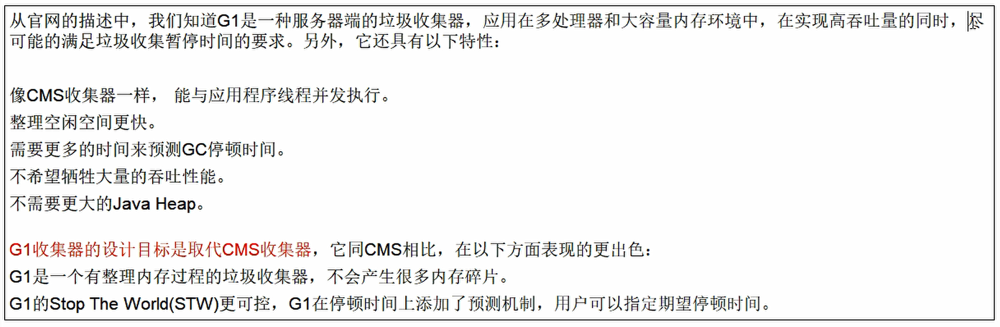
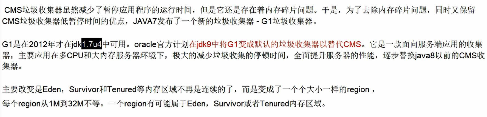
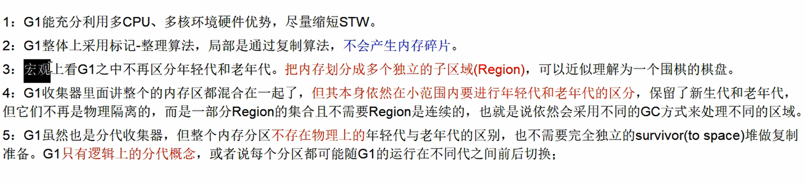
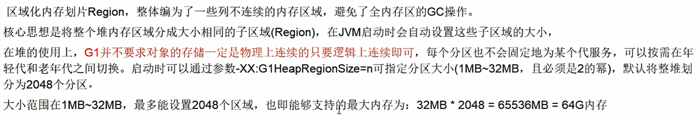
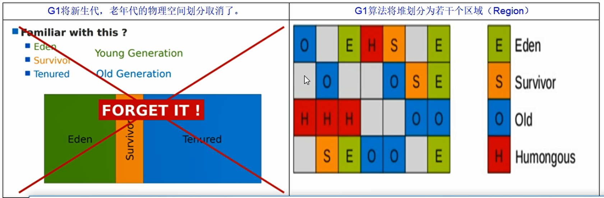
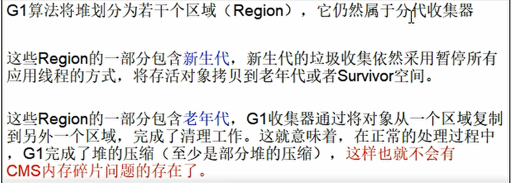
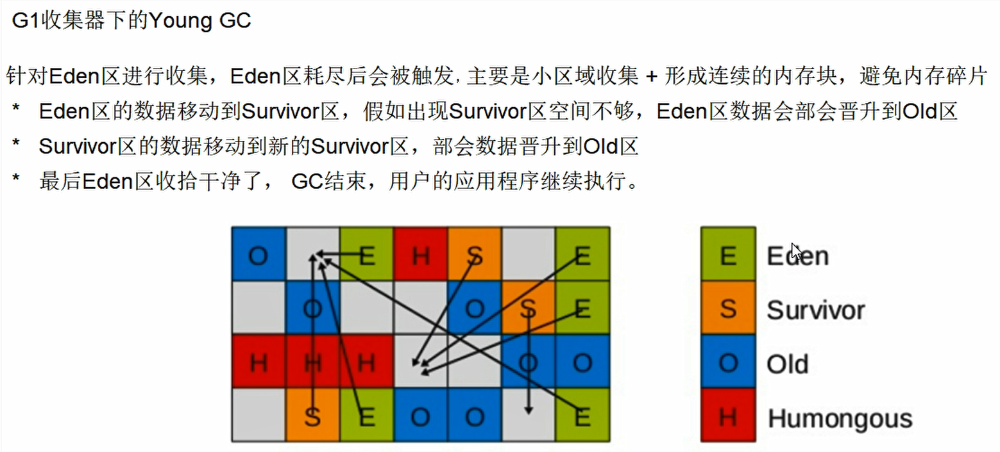
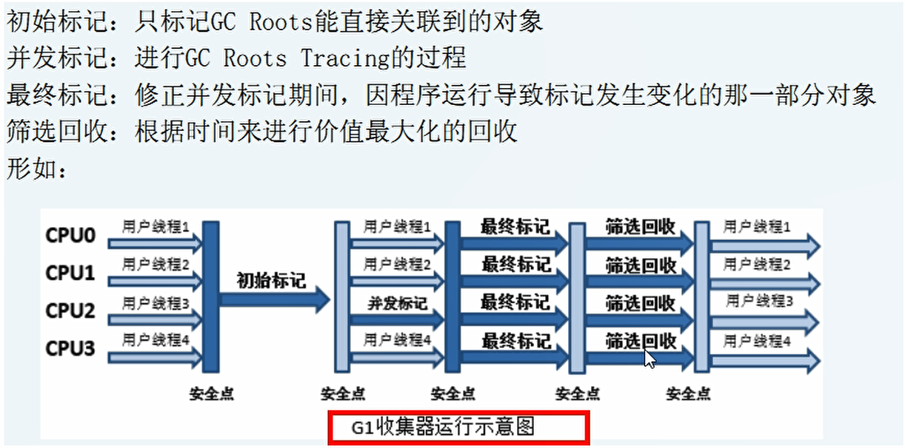
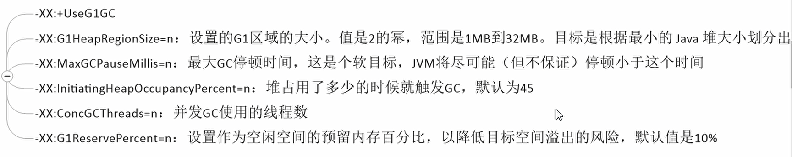
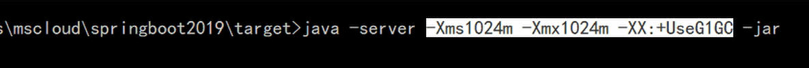

## 6.G1垃圾收集器  G1分块

### 6.1 以前收集器的特点

- 年轻代和老年代是各自独立且连续的内存块
- 年轻代收集使用 分区 eden+from+to进行复制算法
- 老年代收集必须扫描整个老年代区域
- 都是以尽可能少而快速地执行GC为设计原则

### 6.2 G1是什么？

G1收集器时一款面向服务端应用的收集器。

### 6.3 特点

### 6.4 底层原理

#### 6.4.1 region区域化垃圾收集器

> 化整为零，避免全内存扫描，只需要按照区域来进行扫描即可

humongous是专门用来存放大对象的。

#### 6.4.2 回收步骤

分四步：有点像CMS

### 6.5 和CMS对比有什么优势？

- 没有内存碎片
- 可以精确控制停顿，每次根据允许停顿的时间去收集垃圾最多的区域

### 6.6 微服务springboot定制化，外部启动

