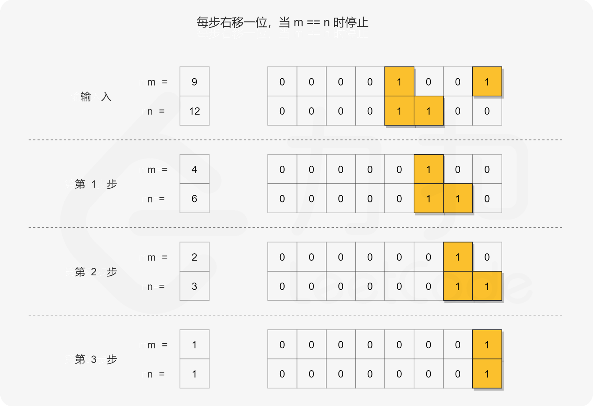

#### [201. 数字范围按位与](https://leetcode-cn.com/problems/bitwise-and-of-numbers-range/)

```java
给定范围 [m, n]，其中 0 <= m <= n <= 2147483647，返回此范围内所有数字的按位与（包含 m, n 两端点）。

示例 1: 
输入: [5,7]
输出: 4
    
示例 2:
输入: [0,1]
输出: 0
```


**答题思路：** 

```
1.暴力会超出时间限制
2.位移，获得公共前缀需要的步数就是我们要获得的数。不过要位移一下。这个是通过数字按位与的规律来的。
```



```
3.Brian Kernighan 算法
```


**答题代码：** 

```java
// 超出时间限制的暴力法 不可取
class Solution {
    public int rangeBitwiseAnd(int m, int n) {
        // 看清楚题目要求：给定的是范围不是两个数的按位与
        int res = m;
        while(m <= n){
            res = res & m;
            m++;
        }
        return res;
    }
}
```

```java
class Solution {
    public int rangeBitwiseAnd(int m, int n) {
        // 看清楚题目要求：给定的是范围不是两个数的按位与
        int shift = 0;
        // 找到公共前缀，相等则为退出条件
        while (m < n) {
            m >>= 1;
            n >>= 1;
            ++shift;
        }
        return m << shift;
    }
}
```

```java
class Solution {
    public int rangeBitwiseAnd(int m, int n) {
        while (m < n) {
            // 抹去最右边的 1
            n = n & (n - 1);
        }
        return n;
    }
}
```


