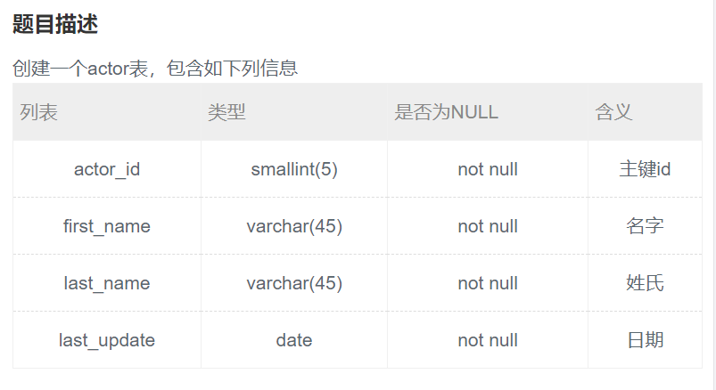

## 33.创建一个actor表




## 题解

```
我又觉得我可以了。
```


## 代码

```sql
create table actor(
    actor_id smallint(5) not null primary key comment '主键id',
    first_name varchar(45) not null comment '名字',
    last_name varchar(45) not null comment '姓氏',
    last_update date not null comment '日期'
)engine = innodb;
```

