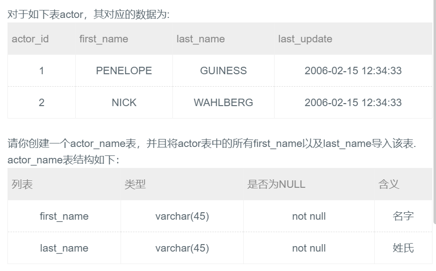

## 36.从已有表创建新表




## 题解

```
这题我面试被坑过啊。
如果不要数据可以在后面加一个where 1 = 0;

USE ssm;
-- as 可以省略，create table xxx selct * from xxx;
CREATE TABLE yjiewei AS SELECT * FROM account;
-- 复制的是表结构
CREATE TABLE yjiewei1 SELECT * FROM account WHERE 1 = 2;

CREATE TABLE yjiewei2 LIKE account;
```


## 代码

```sql
create table actor_name 
as 
    select first_name,last_name 
    from actor;
```

