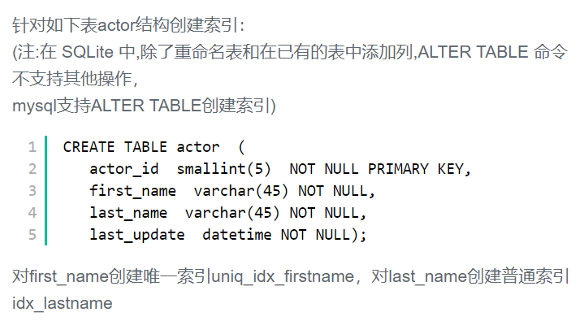

## 37.给字段创建索引




## 题解

```
创建索引的语句是
CREATE [UNIQUE] INDEX ON TABLE_NAME (COLUMN_NAME);
顺带补充一下如何删除索引
ALTER TABLE TABLE_NAME DROP INDEX INDEX_NAME;
```


## 代码

```sql
create unique index uniq_idx_firstname
on actor (first_name);
create index idx_lastname
on actor(last_name);
```

