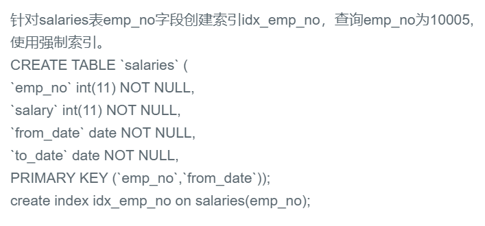

## 39.强制索引from TABLE_NAME FORCE INDEX(XXX)




## 题解

```
那什么，题目已经创建索引了。。。
所以这里只是考察你是否会强制索引。 force index(INDEX_NAME)
```


## 代码

```sql
-- 创建索引，使用强制索引
# create index idx_emp_no 
# on salaries(emp_no);

select * from salaries force index (idx_emp_no) where emp_no = 10005;
```

