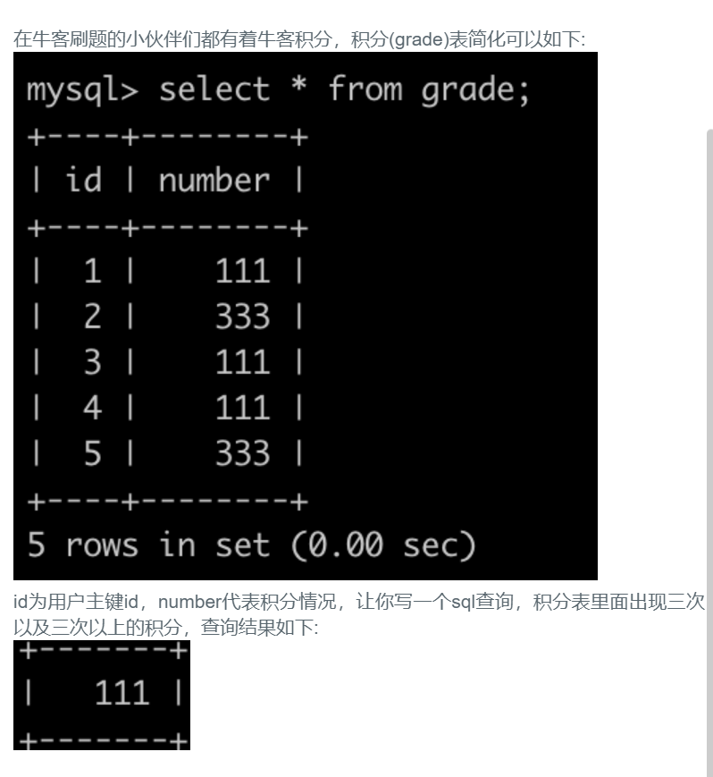

## 62.出现三次以上的积分




## 题解

```
一个内循环查次数以及积分，外循环只要积分大于3.
不过应该用第二种比较好吧。
```


## 代码

```sql
SELECT number FROM (
    select number,count(*) AS times 
    FROM grade 
    GROUP BY number
)AS a
WHERE a.times >= 3;
```

```sql
select number
FROM grade 
GROUP BY number
HAVING count(*) >= 3;
```

