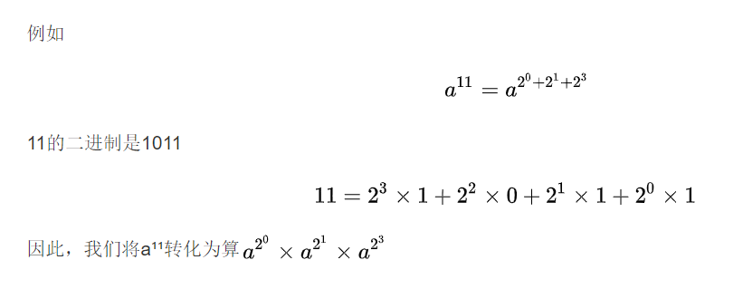

#### [★剑指 Offer 16. 数值的整数次方](https://leetcode-cn.com/problems/shu-zhi-de-zheng-shu-ci-fang-lcof/)

```java
实现函数double Power(double base, int exponent)，求base的exponent次方。不得使用库函数，同时不需要考虑大数问题，但是要考虑负数的情况。
输入: 2.00000, 10
输出: 1024.00000
```


**答题思路：** 

```
时间O(Logn)空间O(1)
快速幂不会超出时间限制。
```



    while(b != 0){
        if((b & 1) == 1) res = res * x;
        b = b>>1;
        x *= x; // 这一步要注意。
    }
    x *= x 其实很容易看混，他不是简单的乘于x，因为每一轮x都在变化，每一轮他就扩大x^2，res相当于记录结果，判断是否要加入计算，变化的x其实就是上面a的次方。
**答题代码：** 

```java
class Solution {
    public double myPow(double x, int n) {
        // 这题要用快速幂来做 
        // 快速幂就是快速求底数的n次幂，时间复杂度是O(LogN)
        // 辅助变量
        long b = n; 
        // 当次方小于0时，我们将次方转为正的，将数值提前取倒数
        // 这样接下来的操作不需要考虑正负
        if( b < 0 ){
            b = -b;
            x = 1/x;
        }
        double res = 1.0;
        // b是次方，每次左移一位，只要那一位是1
        // 说明需要计算，每一次循环都需要左移还有扩大x
        while(b != 0){
            if((b & 1) == 1) res = res * x;
            b = b>>1;
            x *= x; // 这一步要注意。
        }
        return res;
    }
}
```

