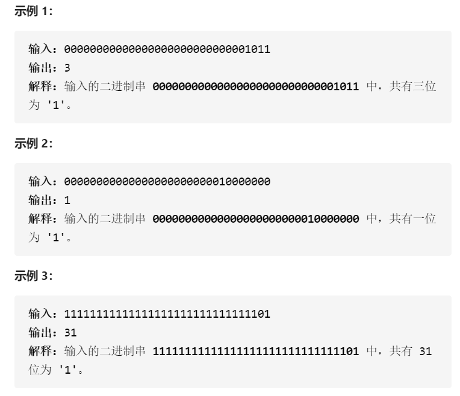

#### [剑指 Offer 15. 二进制中1的个数](https://leetcode-cn.com/problems/er-jin-zhi-zhong-1de-ge-shu-lcof/)

```java
请实现一个函数，输入一个整数（以二进制串形式），输出该数二进制表示中 1 的个数。例如，把 9 表示成二进制是 1001，有 2 位是 1。因此，如果输入 9，则该函数输出 2。
```



**答题思路：** 

```
二进制就离不开位运算，与或异或左移右移，左移补0，右移补的是符号位相同的数字。
第一个代码块中解法是错误的，第二个是常规解法，第三个才是重点。
```


**答题代码：** 

```java
// 错误解法，you need to treat n as an unsigned value 他只是说你要处理负数但是只是计算1的数目
public class Solution {
    // you need to treat n as an unsigned value
    public int hammingWeight(int n) {
        // 无符号、二进制就得想到位运算了
        // 要计算1的数量，默认用位运算都会自动转成二进制的，为什么要与1呢？不能或0吗？
        // 与1只需要最后一位其他一定为0，但是或0，其他为也是0，相当于不能区分
        int count = 0;
        while(n != 0){
            if((n & 1) != 0) count++;
            n = n >> 1;
        }
        return count;
    }
}
```


二进制移位的时候如果是负数会补1，你TM不超出限制谁还会超。

所以，既然传进来的数不能动，那就换成我们自己跟他比较的动。

```java
public class Solution {
    // you need to treat n as an unsigned value
    public int hammingWeight(int n) {
        int count = 0;
        int flag = 1;
        while(flag != 0){
            if((n & flag) != 0) count++;
            flag = flag << 1; // 左移补的是0
        }
        return count;
    }
}
```

```java
// 举个栗子：1100 - 1 = 1011，1011 & 1100 = 1000，也就是多少次循环多少次个1.
public class Solution {
    // you need to treat n as an unsigned value
    public int hammingWeight(int n) {
        int count = 0;
        while(n != 0){
            ++count;
            n = (n-1)&n;
        }
        return count;
    }
}
```

