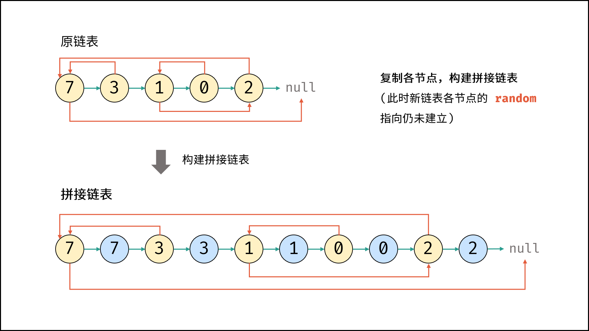

#### [剑指 Offer 35. 复杂链表的复制](https://leetcode-cn.com/problems/fu-za-lian-biao-de-fu-zhi-lcof/)


```
-10000 <= Node.val <= 10000
Node.random 为空（null）或指向链表中的节点。
节点数目不超过 1000 。
```


**答题思路：** 

```
这题看书写的，思路值得借鉴。总共有三种方法，这里只采用第三种，时间复杂度是O(N) 空间是O(N)
1.遍历构造链表及next域，再一次遍历构造random域，但是random每次找到需要再从头找，耗时O(N)*N个数。
2.用空间换时间，对每个node，next作为键值对存放，下次random找的时候能直接从map找到。
3.也就是下面这个方法，每个节点复制在后面，最近进行拆分，但是这样的时间复杂度不还是O(N)吗，你总是要返回一个链表啊。
```



**答题代码：** 

```java
/*
// Definition for a Node.
class Node {
    int val;
    Node next;
    Node random;

    public Node(int val) {
        this.val = val;
        this.next = null;
        this.random = null;
    }
}
*/
class Solution {
    public Node copyRandomList(Node head) {
        // 1.复制每个节点的并存放在每个节点后面
        // 2.复制每个节点的random节点的指向
        // 3.只要复制的节点也就是进行拆分链表
        cloneNodes(head);
        connectRandom(head);
        return realNodes(head);
    }

    // 1.
    void cloneNodes(Node head){
        Node node = head;
        while(node != null){
            Node clone = new Node(node.val);
            clone.next = node.next;
            clone.random = null;
            node.next = clone;
            node = clone.next;
        }
    }

    // 2.
    void connectRandom(Node head){
        Node node = head;
        while(node != null){
            Node clone = node.next;
            if(node.random != null){
                clone.random = node.random.next;
            }
            node = clone.next;
        }
    }
    // 3.
    Node realNodes(Node head){
        Node node = head;
        Node cloneHead = null;
        Node cloneNode = null;

        if(node != null){
            cloneHead = node.next;
            cloneNode = node.next;
            node.next = cloneNode.next; // 漏了
            node = cloneNode.next;
        }
        while(node != null){
            cloneNode.next = node.next;
            cloneNode = cloneNode.next;
            node.next = cloneNode.next;
            node = node.next;
        }
        return cloneHead;
    }
}
```

