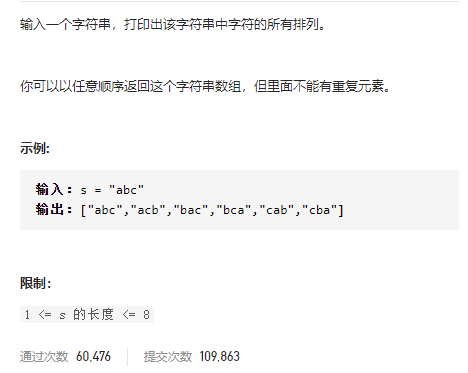
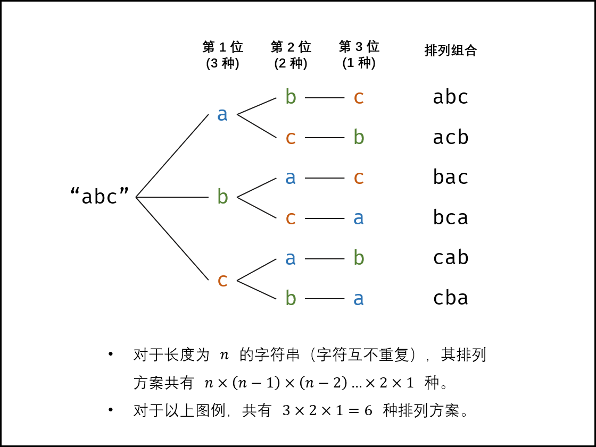

#### [剑指 Offer 38. 字符串的排列](https://leetcode-cn.com/problems/zi-fu-chuan-de-pai-lie-lcof/)



**答题思路：** 

```
无重复的情况以及重复的情况。
重复需要剪枝也就是去除重复的情况，用set完成。
递归循环字符串，每次固定一个字符，深度遍历后面的每个字符。
时间复杂度是O(n!) 每个位置的情况就没上一个元素的情况少1个，且是相乘的情况。不是相加
空间复杂度是O(N2) 递归栈的深度是元素的个数也就是O(N) 但是每个字符都要维护一个大小为N以内的set空间。
	所以是O(N2)
```




**答题代码：** 

```java
// K神的解法
class Solution {
    // 书上没有说重复字符串，但是这里有说
    List<String> res = new LinkedList<>();
    char[] c;
    public String[] permutation(String s) {
        c = s.toCharArray();
        dfs(0);
        return res.toArray(new String[res.size()]);
    }

    void dfs(int x){
        // 最后一个字母
        if(x == c.length - 1){
            res.add(String.valueOf(c));
            return;
        }
        // 每次深度遍历都会有一个新的set来维护目前循环到的字符
        HashSet<Character> set = new HashSet<>(); 
        for(int i = x; i < c.length; i++){
            if(set.contains(c[i])) continue; // 跳出当前循环 剪枝
            set.add(c[i]);
            swap(i,x);
            // 当我交换完遍历完之后后面会再交换回来
            dfs(x+1);
            swap(i,x);
        }
    }

    // 交换字符串的两个字符
    void swap(int a, int b){
        char temp = c[a];
        c[a] = c[b];
        c[b] = temp;
    }
}
```

