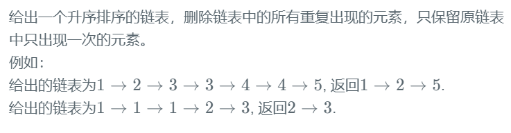

#### ★删除链表中的所有重复出现的元素




**答题思路：** 

```
和83相似。
```


**答题代码：** 

```java
import java.util.*;

/*
 * public class ListNode {
 *   int val;
 *   ListNode next = null;
 * }
 */

public class Solution {
    /**
     * 
     * @param head ListNode类 
     * @return ListNode类
     */
    public ListNode deleteDuplicates (ListNode head) {
        // write code here
        // 只要出现一次的，而且他是有序的，用prev curr curr.next
        if(head == null || head.next == null) return head;
        ListNode shit = new ListNode(-1);
        shit.next = head;
        ListNode cur = head;
        ListNode tem = shit;
        
        while(cur != null && cur.next != null){
            if(cur.val != cur.next.val) tem = cur;
            else{
                while(cur.next != null && cur.val == cur.next.val){
                    cur = cur.next;
                }
                tem.next = cur.next;
            }
            cur = cur.next;
        }
        return shit.next;
    }
}
```

