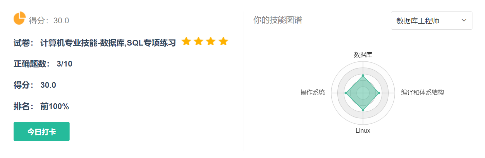
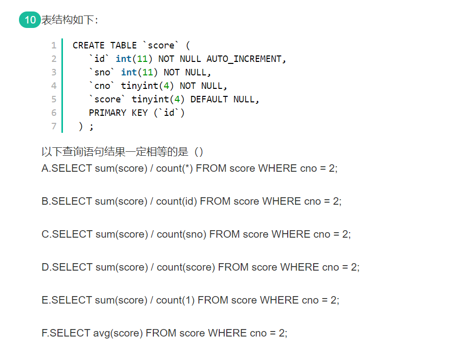
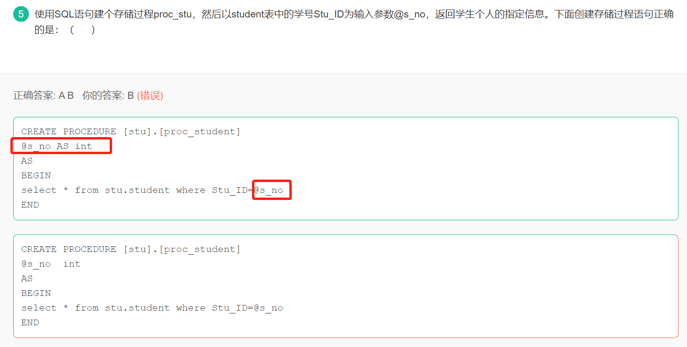
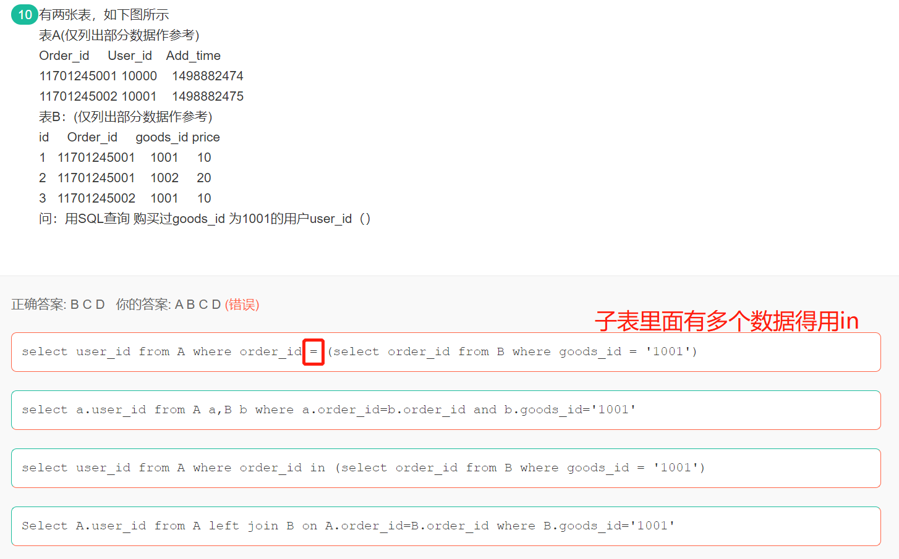

## 数据库

### 复制表数据及结构

```sql
USE ssm;
-- as 可以省略，create table xxx selct * from xxx;
CREATE TABLE yjiewei AS SELECT * FROM account;
-- 复制的是表结构
CREATE TABLE yjiewei1 SELECT * FROM account WHERE 1 = 2;

CREATE TABLE yjiewei2 LIKE account;
```


### 8.5

```
1.A表字段a 类型int中有100条记录，值分别为1至100。如下语句 
SELECT a FROM A WHERE a BETWEEN 1 AND 50 OR (a IN (25,70,95) AND a BETWEEN 25 AND 75)  
则如下哪个值在这个sql语句返回的结果集中?

答案：SELECT a FROM A WHERE a BETWEEN 1 AND 50 OR (a IN (25,70,95) AND a BETWEEN 25 AND 75)
1.  BETWEEN 1 AND 50   
    a的值在 1 到 50 区间，条件则成立
2.  a IN (25,70,95) AND a BETWEEN 25 AND 75
    a的值在 25 到 75 区间且a的值为25,70,95其中一个，条件则成立
    显然，在第一个条件不成立的情况下，这里第二个条件只有70满足条件。

所以，满足上述选择条件的结果集包括 1 到 50，和 70
```


```
2.数据的独立性是数据库系统的最基本的特征之一 。数据独立性是指应用程序和数据结构之间相互独立, 互不影响。
```


```
3.数据库事务四大特性:

    1、原子性（Atomicity）

    原子性是指事务包含的所有操作要么全部成功，要么全部失败回滚，因此事务的操作如果成功就必须要完全应用到数据库，如果操作失败则不能对数据库有任何影响。

    2、 一致性（Consistency）

    一致性是指事务必须使数据库从一个一致性状态变换到另一个一致性状态，也就是说一个事务执行之前和执行之后都必须处于一致性状态。

    拿转账来说，假设用户A和用户B两者的钱加起来一共是5000，那么不管A和B之间如何转账，转几次账，事务结束后两个用户的钱相加起来应该还得是5000，这就是事务的一致性。

    3、隔离性（Isolation）

    隔离性是当多个用户并发访问数据库时，比如操作同一张表时，数据库为每一个用户开启的事务，不能被其他事务的操作所干扰，多个并发事务之间要相互隔离。

    即要达到这么一种效果：对于任意两个并发的事务T1和T2，在事务T1看来，T2要么在T1开始之前就已经结束，要么在T1结束之后才开始，这样每个事务都感觉不到有其他事务在并发地执行。

    4、持久性（Durability）

    持久性是指一个事务一旦被提交了，那么对数据库中的数据的改变就是永久性的，即便是在数据库系统遇到故障的情况下也不会丢失提交事务的操作
```


```
1.1 第一范式（1NF）无重复的列
        所谓第一范式（1NF）是指数据库表的每一列都是不可分割的基本数据项，同一列中不能有多个值，即实体中的某个属性不能有多个值或者不能有重复的属性。如果出现重复的属性，就可能需要定义一个新的实体，新的实体由重复的属性构成，新实体与原实体之间为一对多关系。在第一范式（1NF）中表的每一行只包含一个实例的信息。简而言之，第一范式就是无重复的列。

    说明：在任何一个关系数据库中，第一范式（1NF）是对关系模式的基本要求，不满足第一范式（1NF）的数据库就不是关系数据库。

    数据库表中的字段都是单一属性的，不可再分。这个单一属性由基本类型构成，包括整型、实数、字符型、逻辑型、日期型等。很显然，在当前的任何关系数据库管理系统（DBMS）中，傻瓜也不可能做出不符合第一范式的数据库，因为这些DBMS不允许你把数据库表的一列再分成二列或多列。因此，你想在现有的DBMS中设计出不符合第一范式的数据库都是不可能的。

1.2 第二范式（2NF）属性完全依赖于主键 [ 消除部分子函数依赖 ]
    如果关系模式R为第一范式，并且R中每一个非主属性完全函数依赖于R的某个候选键， 则称为第二范式模式。
    第二范式（2NF）是在第一范式（1NF）的基础上建立起来的，即满足第二范式（2NF）必须先满足第一范式（1NF）。第二范式（2NF）要求数据库表中的每个实例或行必须可以被惟一地区分。为实现区分通常需要为表加上一个列，以存储各个实例的惟一标识。这个惟一属性列被称为主关键字或主键、主码。
    例如员工信息表中加上了员工编号（emp_id）列，因为每个员工的员工编号是惟一的，因此每个员工可以被惟一区分。
    简而言之，第二范式（2NF）就是非主属性完全依赖于主关键字。
    所谓完全依赖是指不能存在仅依赖主关键字一部分的属性（设有函数依赖W→A，若存在XW，有X→A成立，那么称W→A是局部依赖，否则就称W→A是完全函数依赖）。如果存在，那么这个属性和主关键字的这一部分应该分离出来形成一个新的实体，新实体与原实体之间是一对多的关系。
    假定选课关系表为SelectCourse(学号, 姓名, 年龄, 课程名称, 成绩, 学分)，关键字为组合关键字(学号, 课程名称)，因为存在如下决定关系：
    (学号, 课程名称) → (姓名, 年龄, 成绩, 学分)
    这个数据库表不满足第二范式，因为存在如下决定关系：
    (课程名称) → (学分)
    (学号) → (姓名, 年龄)
    即存在组合关键字中的字段决定非关键字的情况。
    由于不符合2NF，这个选课关系表会存在如下问题：
    (1) 数据冗余：
    同一门课程由n个学生选修，"学分"就重复n-1次；同一个学生选修了m门课程，姓名和年龄就重复了m-1次。
    (2) 更新异常：
    若调整了某门课程的学分，数据表中所有行的"学分"值都要更新，否则会出现同一门课程学分不同的情况。
    (3) 插入异常：
    假设要开设一门新的课程，暂时还没有人选修。这样，由于还没有"学号"关键字，课程名称和学分也无法记录入数据库。

    (4) 删除异常：
    假设一批学生已经完成课程的选修，这些选修记录就应该从数据库表中删除。但是，与此同时，课程名称和学分信息也被删除了。很显然，这也会导致插入异常。
    把选课关系表SelectCourse改为如下三个表：
    学生：Student(学号, 姓名, 年龄)；
    课程：Course(课程名称, 学分)；
    选课关系：SelectCourse(学号, 课程名称, 成绩)。
    这样的数据库表是符合第二范式的， 消除了数据冗余、更新异常、插入异常和删除异常。
    另外，所有单关键字的数据库表都符合第二范式，因为不可能存在组合关键字。

1.3 第三范式（3NF）属性不依赖于其它非主属性 [ 消除传递依赖 ]
    如果关系模式R是第二范式，且每个非主属性都不传递依赖于R的候选键，则称R为第三范式模式。
    满足第三范式（3NF）必须先满足第二范式（2NF）。第三范式（3NF）要求一个数据库表中不包含已在其它表中已包含的非主关键字信息。
    例如，存在一个部门信息表，其中每个部门有部门编号（dept_id）、部门名称、部门简介等信息。那么在的员工信息表中列出部门编号后就不能再将部门名称、部门简介等与部门有关的信息再加入员工信息表中。如果不存在部门信息表，则根据第三范式（3NF）也应该构建它，否则就会有大量的数据冗余。
    第三范式（3NF）：在第二范式的基础上，数据表中如果不存在非关键字段对任一候选关键字段的传递函数依赖则符合第三范式。简而言之，第三范式就是属性不依赖于其它非主属性。
    所谓传递函数依赖，指的是如果存在"A → B → C"的决定关系，则C传递函数依赖于A。
    因此，满足第三范式的数据库表应该不存在如下依赖关系：
    关键字段 → 非关键字段x → 非关键字段y
    假定学生关系表为Student(学号, 姓名, 年龄, 所在学院, 学院地点, 学院电话)，关键字为单一关键字"学号"，因为存在如下决定关系：
    (学号) → (姓名, 年龄, 所在学院, 学院地点, 学院电话)
    这个数据库是符合2NF的，但是不符合3NF，因为存在如下决定关系：
    (学号) → (所在学院) → (学院地点, 学院电话)
    即存在非关键字段"学院地点"、"学院电话"对关键字段"学号"的传递函数依赖。
    它也会存在数据冗余、更新异常、插入异常和删除异常的情况，读者可自行分析得知。
    把学生关系表分为如下两个表：
    学生：(学号, 姓名, 年龄, 所在学院)；
    学院：(学院, 地点, 电话)。
    这样的数据库表是符合第三范式的，消除了数据冗余、更新异常、插入异常和删除异常。

1.4 鲍依斯-科得范式（BCNF是3NF的改进形式）
    若关系模式R是第一范式，且每个属性都不传递依赖于R的候选键。这种关系模式就是BCNF模式。即在第三范式的基础上，数据库表中如果不存在任何字段对任一候选关键字段的传递函数依赖则符合鲍依斯-科得范式。
    假设仓库管理关系表为StorehouseManage(仓库ID, 存储物品ID, 管理员ID, 数量)，且有一个管理员只在一个仓库工作；一个仓库可以存储多种物品。这个数据库表中存在如下决定关系：
    (仓库ID, 存储物品ID) →(管理员ID, 数量)
    (管理员ID, 存储物品ID) → (仓库ID, 数量)
    所以，(仓库ID, 存储物品ID)和(管理员ID, 存储物品ID)都是StorehouseManage的候选关键字，表中的唯一非关键字段为数量，它是符合第三范式的。但是，由于存在如下决定关系：
    (仓库ID) → (管理员ID)
    (管理员ID) → (仓库ID)
    即存在关键字段决定关键字段的情况，所以其不符合BCNF范式。它会出现如下异常情况：

    (1) 删除异常：
    当仓库被清空后，所有"存储物品ID"和"数量"信息被删除的同时，"仓库ID"和"管理员ID"信息也被删除了。

    (2) 插入异常：
    当仓库没有存储任何物品时，无法给仓库分配管理员。

    (3) 更新异常：
    如果仓库换了管理员，则表中所有行的管理员ID都要修改。
    把仓库管理关系表分解为二个关系表：
    仓库管理：StorehouseManage(仓库ID, 管理员ID)；
    仓库：Storehouse(仓库ID, 存储物品ID, 数量)。
    这样的数据库表是符合BCNF范式的，消除了删除异常、插入异常和更新异常。
```


```
4.Mysql 选择合适的数据类型 ，说法正确的是（      ）
正确答案: A B D   你的答案: A B C D (错误)
MyISAM引擎的数据表，最好使用固定长度的数据列代替可变长度的数据列。
对于InnoDB引擎数据表，内部的行存储格式没有区分固定长度和可变长度列，字符型数据建议使用VARCHAR类型
对于字段长度要求超过 128个的情况下，MySQL 提供了 TEXT 和 BLOB 两种类型。根据存储数据的大小，它们都有不同的子类型。这些大型的数据用于存储文本块或图像、声音文件等二进制数据类型。
对货币等精度敏感的数据，应该用定点数表示或存储。

在保存较大文本时， 通常会选择使用 TEXT 或者 BLOB，二者之间的主要差别是 BLOB保存二进制数据，比如照片；而 TEXT 只能保存字符数据，比如一篇文章等等。
```


### 12.31

> 3/10你可真行啊。



```
1.关系R和S进行自然连接时，要求R和S含有一个或多个公共（）
正确答案: D   你的答案: A (错误)
元组
行
记录
属性

什么是自然连接：
   特殊等值连接，必须有相同属性组，并把重复的列去掉，而等值连接并不去掉重复的列。
元组是每一行数据/数据记录，每列就是一个属性。
```

重点

```
2.数据库三级模式体系结构的划分，有利于保持数据库的 (  )。

正确答案: A   你的答案: C (错误)
数据独立性
数据安全性
结构规范化
操作可行性

三级模式是外模式、概念模式、内模式，有利于数据的逻辑独立性和物理独立性。
关系数据模型的三个组成部分是 数据结构、操作集合、完整性约束。
```

```
3.数据库在磁盘上的基本组织形式是（ ）。

正确答案: B   你的答案: A (错误)
DB
文件
二维表
系统目录
```

```
4.当 B属性函数依赖于A属性时，属性A与B 的联系是 
正确答案: B   你的答案: A (错误)
1对多
多对1
多对多
1对 1

B依赖于A，也就是知道A才能知道B，所以A -> B，因为A -> B，表示对于A中的每一个属性在B中只有唯一的一个值与之对应，而B中的一个值可与A中的多个值对应，所以A、B之间的联系是从A到B的多对一联系。所以答案应为B。y = x^2
```

```
5.设有关系模式R(A，B，C，D)，F是R上成立的FD集，F={B→C,C→D},则属性C的闭包C+为
正确答案: C   你的答案: D (错误)
BCD
BD
CD
BC

闭包就是由一个属性直接或间接导出所有属性的集合。
例如：
f={a->b,b->c,a->d,e->f} 
由a可直接得到b和d，间接得到c，则a的闭包就是{a,b,c,d}
```

```
6.①模式（schema）：
       模式也称逻辑模式，是数据库中全体数据的逻辑结构和特征的描述，是所有用户的公共数据视图。

②外模式（external schema）：
       外模式也称子模式（subschema）或用户模式，它是数据库用固话（包括应用程序员和最终用户）能够看见和使用的局部数据的逻辑结构和特征的描述，是数据库用户的数据视图，是与某一应用有关的数据的逻辑表示。

③内模式（internal schema）：
       内模式也称存储模式（storage schema），一个数据库只有一个内模式。它是数据物理存储和存储方式的描述，是数据在数据库内部的组织方式.
```

重点

```
先说候选码，候选码就是可以区别一个元组（即表中的一行数据）的属性或属性的集合，比如学生表student(id,name,age,sex,deptno),其中的id是可以唯一标识一个元组的，所以id是可以作为候选码的，既然id都可以做候选码了，那么id和name这两个属性的组合可不可以唯一区别一个元组呢？显然是可以的，此时的id可以成为码，id和name的组合也可以成为码，但是id和name的组合不能称之为候选码，因为即使去掉name属性，剩下的id属性也完全可以唯一标识一个元组，就是说，候选码中的所有属性都是必须的，缺少了任何一个属性，就不能唯一标识一个元组了，给候选码下一个精确的定义就是：可以唯一标识一个元组的最少的属性集合。而码是没有最少属性这个要求的。另外，一个表的候选码可能有多个，从这些个候选码中选择一个做为主码，至于选择哪一个候选码，这个是无所谓的，只要是从候选码中选的就行。

至于主属性，刚才提到了，一个表可以有多个候选码，那么对于某个属性来说，如果这个属性存在于所有的候选码中，它就称之为主属性
```

```
SQL语言的功能有三个 DDL DQL DCL DML数据操纵
数据定义：CREATE、DROP、ALTER
数据操作：SELECT、DELETE、UPDATE、INSERT
数据控制：GRANT、DENY、REVOKE
```

```
7.在 SELECT 语句中使用 MAX(列名)时，列名应该（）。
正确答案: D   你的答案: C (错误)
必须是数值型
必须是字符型
必须是数值型或字符型
不限制数据类型

一般是数值、字符串、日期时间等不限制。
```

### 1.2



ABCE是一样的，DF是一样的，D中count(score)不会计算空值，F计算平均值也不会计算空值。


```
2.下面有关sql 语句中 delete truncate的说法正确的是？（）
正确答案: A C   你的答案: A B (错误)
论清理表数据的速度，truncate一般比delete更快
truncate命令可以用来删除部分数据。
truncate只删除表的数据不删除表的结构
delete能够回收高水位

1、处理效率：drop>trustcate>delete
2、drop删除整个表；trustcate删除全部记录，但不删除表；delete删除部分记录
3、delete不影响所用extent，高水线保持原位置不动；truncate会将高水线复位。

truncate将直接删除原来的表， 并重新创建一个表， 因此执行速度比delete快
```


```
3.修改表test_tbl字段i的缺省值为1000，可以使用SQL语句（      ）
正确答案: A   你的答案: B (错误)
ALTER TABLE test_tbl ALTER i SET DEFAULT 1000; // 修改字段数据
ALTER TABLE test_tbl i SET DEFAULT 1000;
ALTER TABLE test_tbl MODIFY i SET DEFAULT 1000;
ALTER TABLE test_tbl CHANGE i SET DEFAULT 1000;

// modify用来修改字段类型
// change用来修改字段名字以及类型
```


### 1.3



```
2.在SQL中语法规范中，having子句的使用下面描述正确的是：（       ）
正确答案: A C   你的答案: A C E (错误)
having子句即可包含聚合函数作用的字段也可包括普通的标量字段  ✔
使用having的同时不能使用where子句
having子句必须于group by 子句同时使用，不能单独使用      ✔
使用having子句的作用是限定分组条件
Having子句和where子句是等同的   ✖
如果select语句中没有聚合函数的使用，就不能使用having子句

having是用来限制组的条件，而where是用来限制行的。
```

重点

3.where子句中不能使用聚合函数。

4.sql执行顺序 

- from 
- join 
- on 
- where 
- group by(开始使用select中的别名，后面的语句中都可以使用)
- avg,sum.... 
- having 
- select 
- distinct 
- order by



```
6.下面哪些字符最可能会导致sql注入?
正确答案: A   你的答案: D (错误)
‘（单引号）
/
"(双引号)
$

sql注入问题主要是单引号不闭合的原因。

防止SQL注入，需要注意以下几个要点：
永远不要信任用户的输入。对用户的输入进行校验，可以通过正则表达式，或限制长度；对单引号和双"-"进行转换等。
永远不要使用动态拼装sql，可以使用参数化的sql或者直接使用存储过程进行数据查询存取。
永远不要使用管理员权限的数据库连接，为每个应用使用单独的权限有限的数据库连接。
不要把机密信息直接存放，加密或者hash掉密码和敏感的信息。
应用的异常信息应该给出尽可能少的提示，最好使用自定义的错误信息对原始错误信息进行包装
sql注入的检测方法一般采取辅助软件或网站平台来检测，软件一般采用sql注入检测工具jsky，网站平台就有亿思网站安全平台检测工具。MDCSOFT SCAN等。采用MDCSOFT-IPS可以有效的防御SQL注入，XSS攻击等。
```

### 1.7

```
1.关于数据库的索引，如下那个选项是正确的？
正确答案: D   你的答案: B (错误)
针对某些字段建立索引，能够有效的减少相关数据库表的磁盘空间占用；  // 会增加磁盘占用
针对某些字段建立索引，能够有效的提升相关字段的读与写的效率；     // 只是提高了读速度，写速度甚至会下降
常见数据库管理系统，通常使用hash表来存储索引；     // B+树
数据库索引的存在，可能导致相关字段删除的效率降低；     // 删除数据需要调整索引，效率会下降
```


```
2.用命令（）可以查看mysql数据库中user表的表结构？
正确答案: A B D   你的答案: B C D (错误)
desc user;
show create table user;
show columns for user;
describe user;

查看Mysql表结构的命令，如下:
desc 表名;
show columns from 表名;
describe 表名;
show create table 表名;
use information_schema select * from columns where table_name='表名';
```


