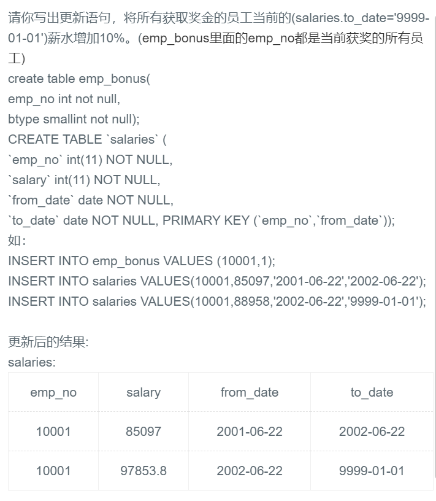

## 48.给符合条件的员工加工资




## 题解

```
尽量不要连接两个表，直接筛选就行。
另外 update TABLE_NAME set column where condition
```


## 代码

```sql
update salaries set salary = salary * 1.1 
where emp_no in (select emp_no from emp_bonus) and to_date = '9999-01-01';
```

