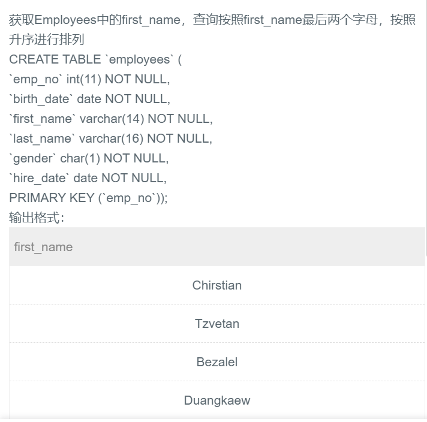

## 52.substr()对Employees中的first_name最后两个字母实现排序




## 题解

```
substr(字符串，起始位置，长度）
起始位置:截取的子串的起始位置（注意:字符串的第一个字符的索引是1）。
值为正时从字符串开始位置 开始计数，值为负时从字符串结尾位置开始计数。
长度:截取子串的长度

这里没有指明长度也是可以的，就到最后呗
如果这里用-2也就是倒数第二个开始到最后。
```


## 代码

```sql
select first_name from employees
order by substr(first_name,length(first_name)-1);
```

```sql
select first_name from employees
order by substr(first_name,-2);
```

