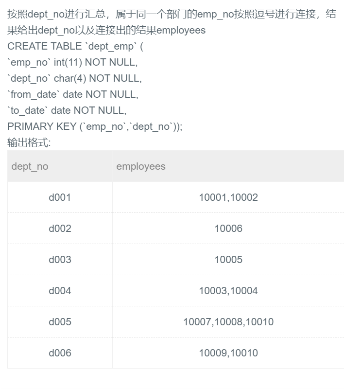

## ★53.group_concat(x,y) || group_concat(x separator ',')




## 题解

```
聚合函数group_concat（X，Y），其中X是要连接的字段，Y是连接时用的符号，可省略，默认为逗号。
此函数必须与GROUP BY配合使用。此题以dept_no作为分组，将每个分组中不同的emp_no用逗号连接起来（即可省略Y）。
默认是逗号
默认是逗号
默认是逗号

另外可以参考第二个的写法：separator
我用第一种感觉是在逗号的基础上加其他符号，而不是替代，用第二种似乎比较规范。
```


## 代码

```sql
-- 这要拼接多个字段还用concat()吗？怎么有点动态sql的感觉
-- 果然离不开concat。这里用的是group_concat(x,y)必须和group by配合使用
select dept_no,group_concat(emp_no) employees 
from dept_emp group by dept_no;
```

```sql
select dept_no,group_concat(emp_no separator ',') employees 
from dept_emp group by dept_no;
```

