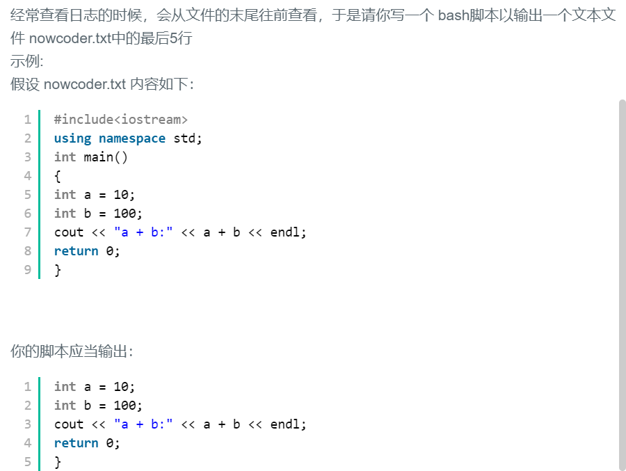
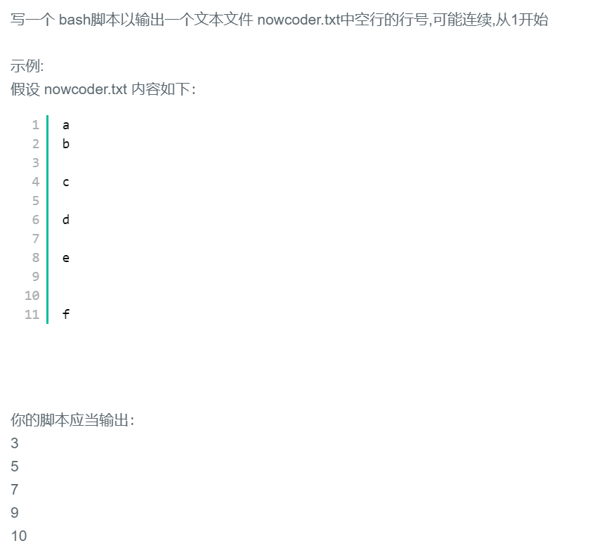
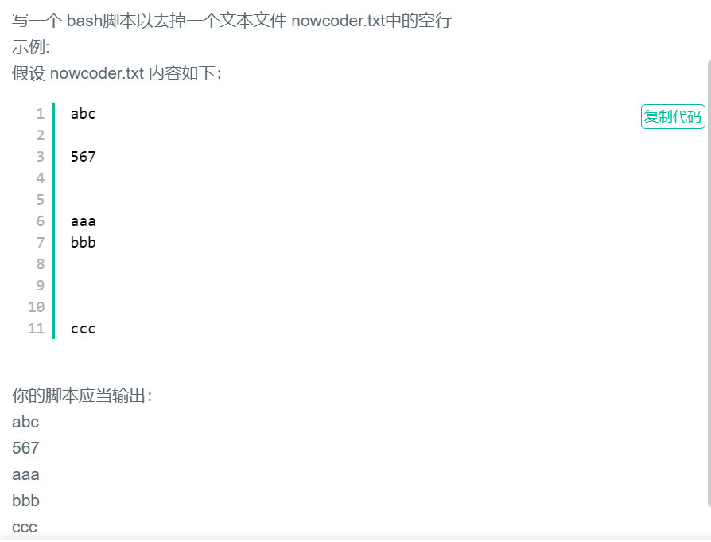

## Shell题目合集

> 因为题目比较少，所以就直接写在一个文档，便于查看。

### 1.统计文件行数 wc awk

```
题目：写一个 bash脚本以输出一个文本文件 nowcoder.txt中的行数
示例:
假设 nowcoder.txt 内容如下：
#include <iostream>
using namespace std;
int main()
{
    int a = 10;
    int b = 100;
    cout << "a + b:" << a + b << endl;
    return 0;
}
你的脚本应当输出：9
```

#### 题解：

```
# wc用于计算字数word count -l 代表显示行数，后面自然是文件名
# 管道命令后面是awk对文本进行分析，没有分割-F，也没有正则，直接输出变量1，也就是结果。
#!/bin/bash
wc -l ./nowcoder.txt | awk '{print $1}'
```

```
# -n<行数> 显示文件的尾部 n 行内容
#!/bin/bash
awk '{print NR}' ./nowcoder.txt | tail -n 1
```

```
#!/bin/bash
awk 'END{print NR}' ./nowcoder.txt
```

```bash
# 这个没看懂
#!/bin/bash
sed -n '$=' ./nowcoder.txt
```


### 2.打印文件最后5行 tail -n 5 nowcoder.txt



#### 题解：

```
#!/bin/bash
tail -n 5 ./nowcoder.txt
```


### 3.输出数字 0 到 500 中 7 的倍数 while

写一个 bash脚本以输出数字 0 到 500 中 7 的倍数(0 7 14 21...)的命令

#### 题解：变量的操作

```bash
#!/bin/bash
i=0
while((  $i<=500 ))
do
    j=$[$i%7]
    if [ $j -eq 0 ]
    then 
        echo $i
    fi
    let "i++"
done
```


### 4.输出第5行内容

```
写一个 bash脚本以输出一个文本文件 nowcoder.txt 中第5行的内容。
示例:
假设 nowcoder.txt 内容如下：
welcome
to
nowcoder
this
is
shell
code

你的脚本应当输出：
is
```

#### 题解：

```
# #!/bin/bash
# sed -n -e "5,5p" nowcoder.txt

#!/bin/bash
awk '{if(NR==5){print $0}}' nowcoder.txt
```


### 5.打印空行的行号



#### 题解：

```
#!/bin/bash
awk '/^$/ {print NR}' nowcoder.txt
```


### 6.删除空行 sed 



#### 题解：

```
#!/bin/bash
sed '/^$/ d' nowcoder.txt
```


### 三级标题为题目，四级为题解。