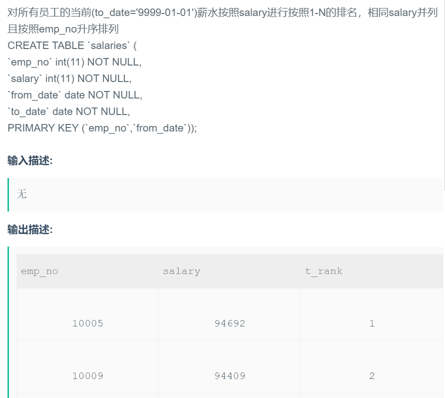

## 23.给所有员工薪资进行排名 窗口函数




## 题解

```
涉及到排名的题目还挺多，一个使用窗口函数，一个用子查询来获得每个薪资比他大的有多少个来求得排名
dense_rank() over (order by salary desc)...
子查询。。。
建议多写几次吧。
```


## 代码

```sql
# select emp_no,salary,dense_rank() over (order by salary desc) as t_rank
# from salaries 
# where to_date='9999-01-01' 
# order by t_rank,emp_no; -- 这里不能用order by salary的原因是：你本就只是在每个数据后面加了一个排名，接下来是要按照排名来计算，不是按照没有排名的薪资。
```

```sql
select s1.emp_no,s1.salary,
(
    select count(distinct s2.salary) 
    from salaries s2
    where s2.to_date = '9999-01-01' and s2.salary >= s1.salary 
)as t_rank
from salaries s1
where s1.to_date = '9999-01-01' 
order by t_rank,s1.emp_no;
```

