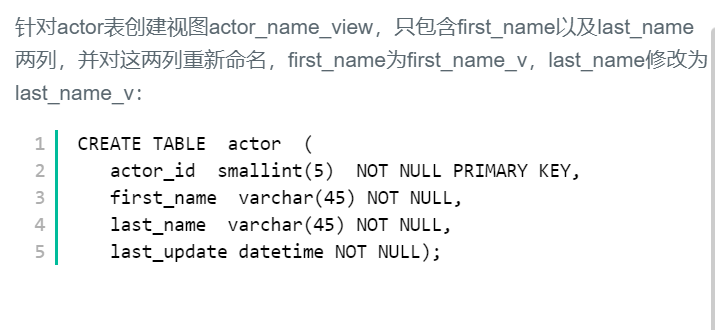

## 38.创建视图




## 题解

```
真就只是创建一个视图呗，视图是可视化的表。就像一张表的数据一样。
语法：CREATE VIEW view_name as
	select column_names
	from table_name
	where condition;
有点想复制一个表结构。
```


## 代码

```sql
create view actor_name_view as 
select first_name first_name_v,last_name last_name_v
from actor;
```

