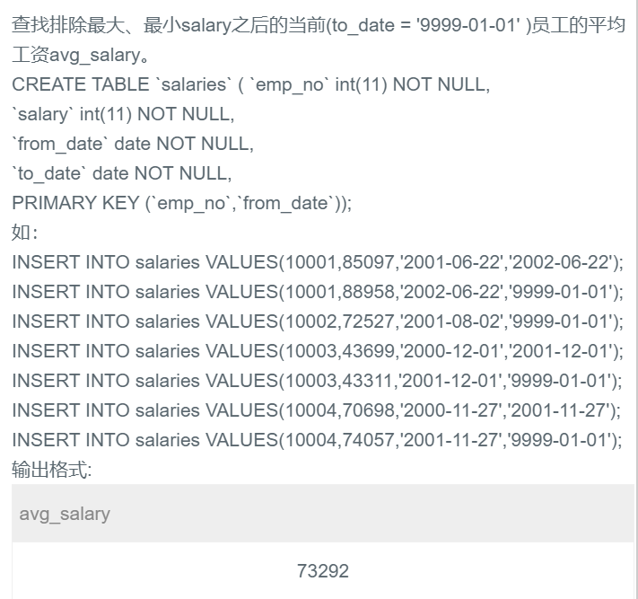

## 54.查找排除最大、最小salary之后的当前(to_date = '9999-01-01' )员工的平均工资avg_salary




## 题解

```
这题不难，就是聚合函数的使用，另外条件要分清楚。
```


## 代码

```sql
-- 先求总和再减去最小值和最大值再求平均值，下面这种写法不能确保每个人的工资都是to_date值
# select avg(sum(salary)- max(salary)-min(salary)) as avg_salary
# from salaries
# where to_date = '9999-01-01';

-- 也不难，在salary中筛选最大值和最小值时添加条件即可。
select avg(salary) as avg_salary from salaries
where to_date = '9999-01-01'
and salary not in (select max(salary) from salaries where to_date = '9999-01-01')
and salary not in (select min(salary) from salaries where to_date = '9999-01-01');
```

