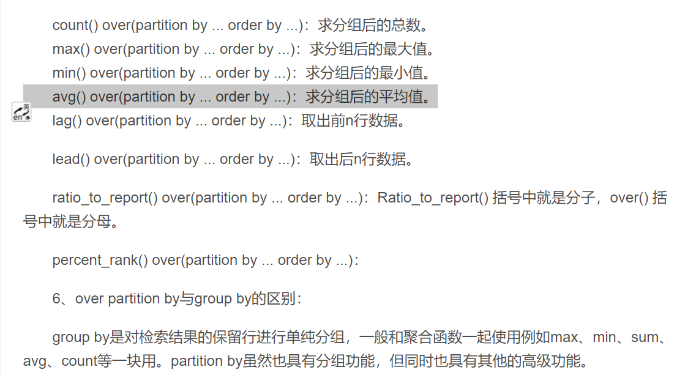

## 73.考试分数二

[考试分数二](https://www.nowcoder.com/practice/f456dedf88a64f169aadd648491a27c1?tpId=82&rp=1&ru=%2Fta%2Fsql&qru=%2Fta%2Fsql%2Fquestion-ranking)


## 题解

```
不难，主要是你得记住如果子查询中直接group by会出现多个数据，这样不能直接比对，得通过连接表。
第二种写法很有意思啊，直接窗口函数，求分组后的平均值。
```



## 代码

```sql
-- 用户大于平均分  id升序也就是默认的
select g1.* from grade g1,
(select job,avg(score) sc from grade group by job
)as g2
where g1.job = g2.job and g1.score > g2.sc;
```

```sql
select id,job,score from(
select *,avg(score) over (partition by job) as avg_score
from grade) a
where score>avg_score
order by id;
```

