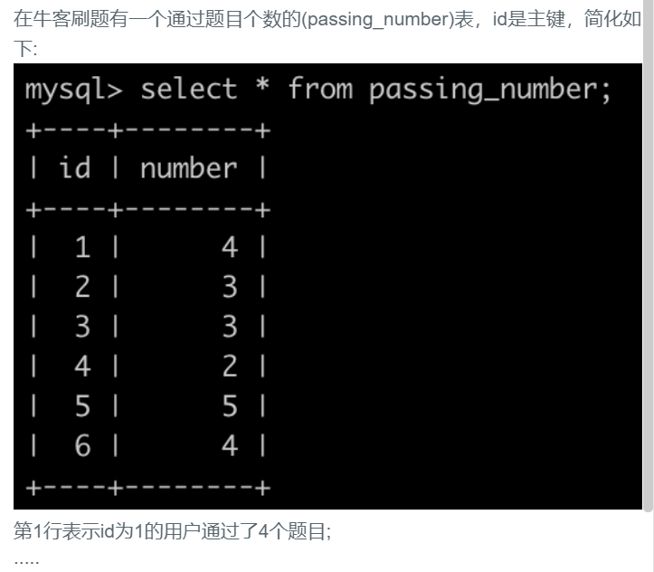
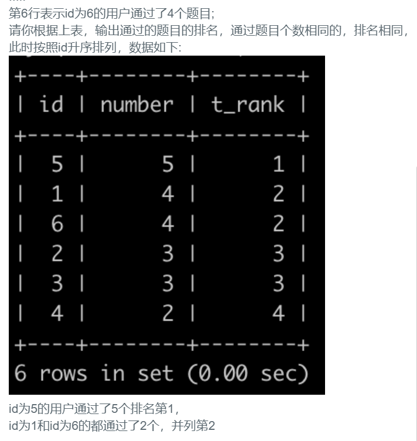

## 63.刷题通过的题目排名





## 题解

```
对于数据库支持分析函数的，可以使用分析函数将更简单，这里区别于 RANK（），详细用法请自行百度。注：mysql 8.0 开始才支持分析函数。
rank()是直接排名没有去重
dense_rank()有去重排名。
https://www.cnblogs.com/shizhijie/p/9366247.html
```


## 代码

```sql
-- 这题难在我不知道怎么设置排序 应该是使用哪个rank函数吧 然后还要排序（先排名后id）
-- dense_rank() 和 rank()区别在于 一个是1，2，2，3 后者是1，2，2，4
# SELECT
# 	*,
# 	dense_rank ( ) over ( ORDER BY number DESC ) `rank` 
# FROM
# 	passing_number 
# ORDER BY
# 	`rank`,
# 	id;

-- 在不使用函数的情况下怎么解决呢，这里每个rank都要用左上角的符号引用 `rank` 不是'rank'
-- 简单分析下，两张表自连接，把一张表1的数据全部取出来，另外一张表2来构造排名
-- 对于表2，计算表1的数字比表2的小的有多少个并要去重
select p1.id, p1.number,count(DISTINCT p2.number) `rank`
from passing_number p1,passing_number p2
where p1.number <= p2.number
group by p1.id
order by `rank`,p1.id;
```

