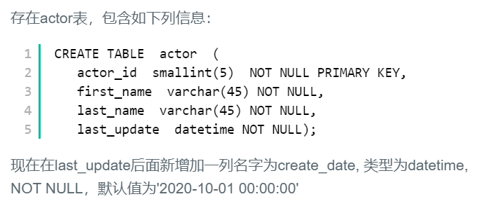

## ☆40.在last_update后面新增加一列名字为create_date




## 题解

```
添加一列字段，语法是
alter table TABLE_NAME add COLUMN_NAME XXX XXX DEFAULT XXX;
默认添加在表尾。
```


## 代码

```sql
alter table actor 
add 
    create_date datetime not null 
    default '2020-10-01 00:00:00';
```

