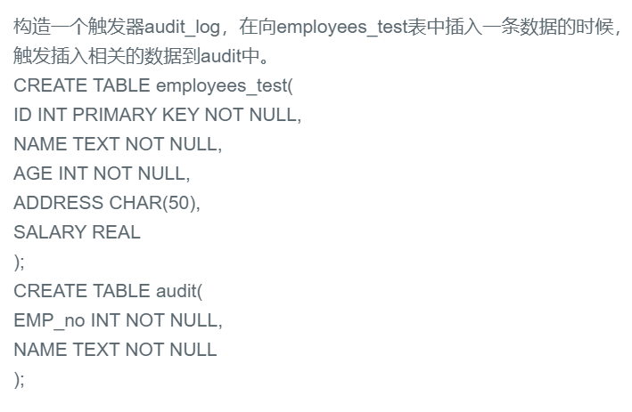

## ☆41.创建一个触发器




## 题解

```
NEW 代表着添加后的值。OLD你懂的
背吧
```


## 代码

```sql
create trigger audit_log
after insert on employees_test 
for each row
begin
    insert into audit(emp_no,name) values(NEW.ID,NEW.NAME); -- 分号不能少
end;
```

