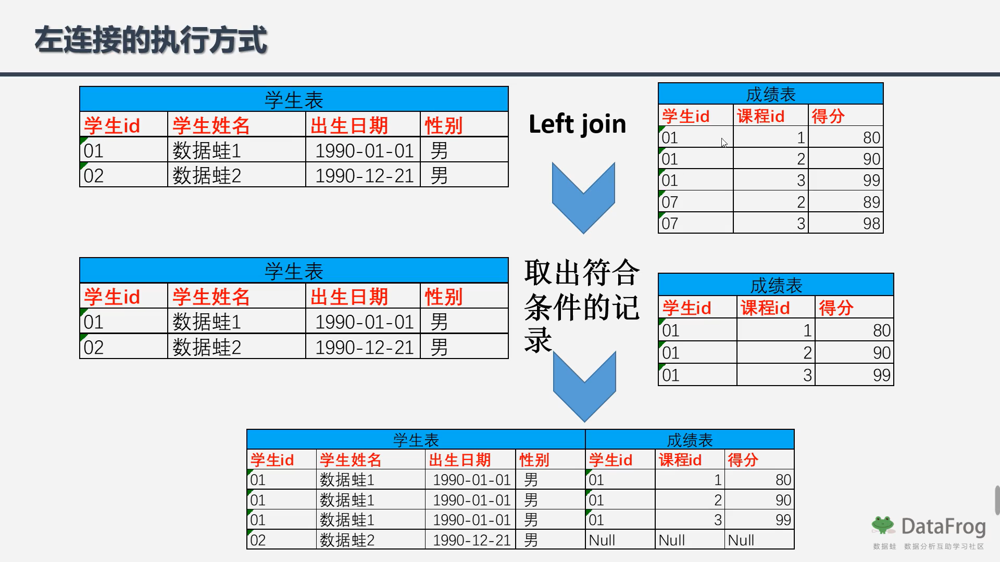
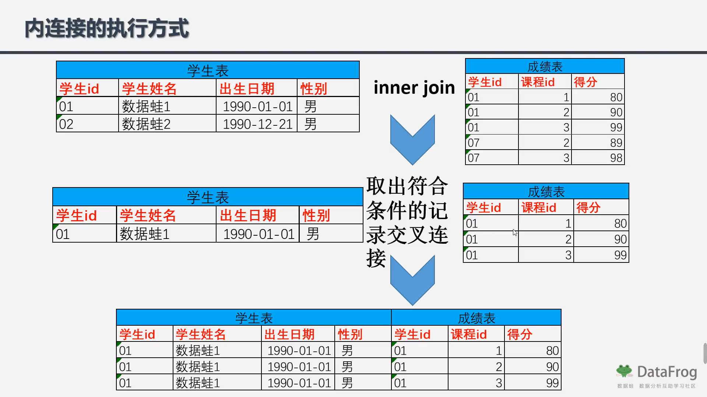

## 24.inner join left join的区别


## 题解

```
就是四张表之间的关联，逻辑不复杂，但是我对inner join 和left join 的区分不是很懂。
left Join 就是完全保留左表的数据，右表可以为空。
```






## 代码

```sql
-- 共有四张表 第一个连接不能用left join，也就是说左连接可能会导致第一个连接不能做到筛选manager_no
select de.dept_no,de.emp_no,sa.salary from dept_emp de inner join  
(
    select em.emp_no from employees em
    where em.emp_no not in (select emp_no from dept_manager dm)
) as edm
on de.emp_no = edm.emp_no
left join salaries sa
on de.emp_no = sa.emp_no
where sa.to_date = '9999-01-01';
```

